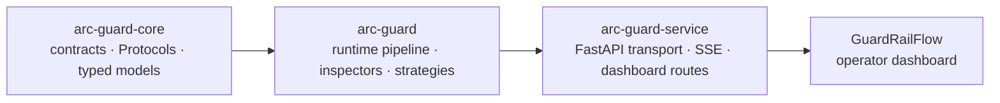
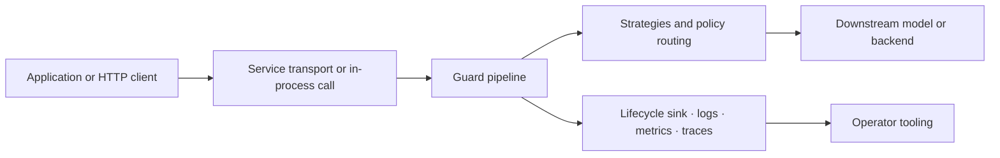

# Architecture

arc-guardrails separates contract types, runtime behavior, and transport concerns so the core data model stays lightweight while the full runtime remains extensible.

## Package Split

| Package | Responsibility | Typical consumer |
| --- | --- | --- |
| `packages/core` | Zero-dependency contract layer with typed models, protocols, lifecycle events, stages, and exceptions | Library authors and integrators building against stable contracts |
| `packages/pip` | The full runtime pipeline, built-in inspectors, strategies, selectors, reporters, observability sinks, and optional extras | Application teams that want a working guardrail out of the box |
| `packages/api` | FastAPI deployment surface, request transport, SSE event feed, dashboard routes, and settings | Teams exposing the pipeline as a service boundary |
| `apps/guardrail-flow` | Operator dashboard for request traces, lifecycle replay, and debugging | Operators monitoring live traffic |

## Design Constraints

- `arc-guard-core` stays provider-neutral and avoids heavyweight runtime dependencies.
- `arc-guard` carries concrete behavior and optional extras such as semantic scoring, OTEL, and ML-backed jailbreak detection.
- `arc-guard-service` owns HTTP behavior and operator read routes, but no guardrail logic lives there.
- The Makefile remains the single top-level command surface for local setup, smoke tests, and service orchestration.

## Runtime Surfaces

## Why This Layout Matters

The split is not cosmetic. It keeps the stable public contract smaller than the full runtime export surface, which helps downstream users pin against `arc-guard-core` without inheriting runtime-specific coupling. It also lets the service layer evolve transport details independently of the core pipeline semantics.

For a deeper view of request execution, continue to [Pipeline](/guide/pipeline).