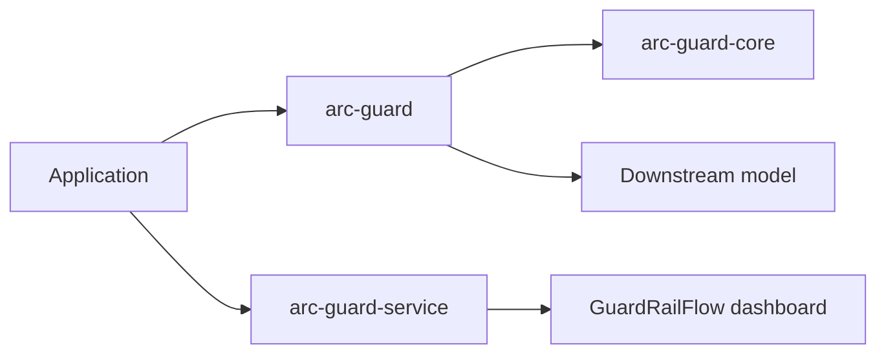

# Guide

arc-guardrails is built as a reusable guardrail layer for LLM applications that need strong control over sensitive content, prompt injection risk, and downstream auditability. The repository is intentionally split so you can adopt the contract layer alone, the batteries-included runtime, or the HTTP service and dashboard surfaces together.

## What You Will Find Here

| Topic                                          | What to read next                       |
| ---------------------------------------------- | --------------------------------------- |
| High-level design                              | [Architecture](/guide/architecture)     |
| Stage-by-stage request behavior                | [Pipeline](/guide/pipeline)             |
| Local installation and operator workflows      | [Setup](/guide/setup)                   |
| Adding custom inspectors, strategies, or sinks | [Extension Patterns](/guide/extensions) |

## Core Capabilities

- Protocol-driven extension points across inspectors, strategies, policy routing, observability, and lifecycle sinks.
- A 12-stage pipeline that validates, classifies, sanitizes, routes, executes, verifies, and reports every guarded request.
- A transport-neutral deployment model: library-only usage, service deployment, or a local full stack with dashboard and Docker support.
- A repository-level Makefile that standardizes install, smoke-test, API boot, Docker stack, and verification workflows.

## Reading Path

1. Start with the architecture page to understand the package split and runtime surfaces.
2. Move to the pipeline page to see how a request becomes `pass`, `redact`, `warn`, or `block`.
3. Use setup when you are ready to run the repository locally.
4. Use extension patterns when you need to add custom logic without forking core internals.

The rest of the site expands those surfaces into implementation detail, public reference, and interactive flow documentation.
