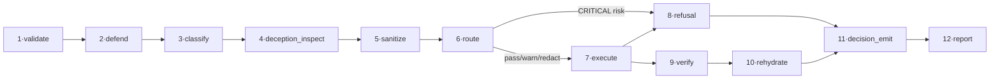
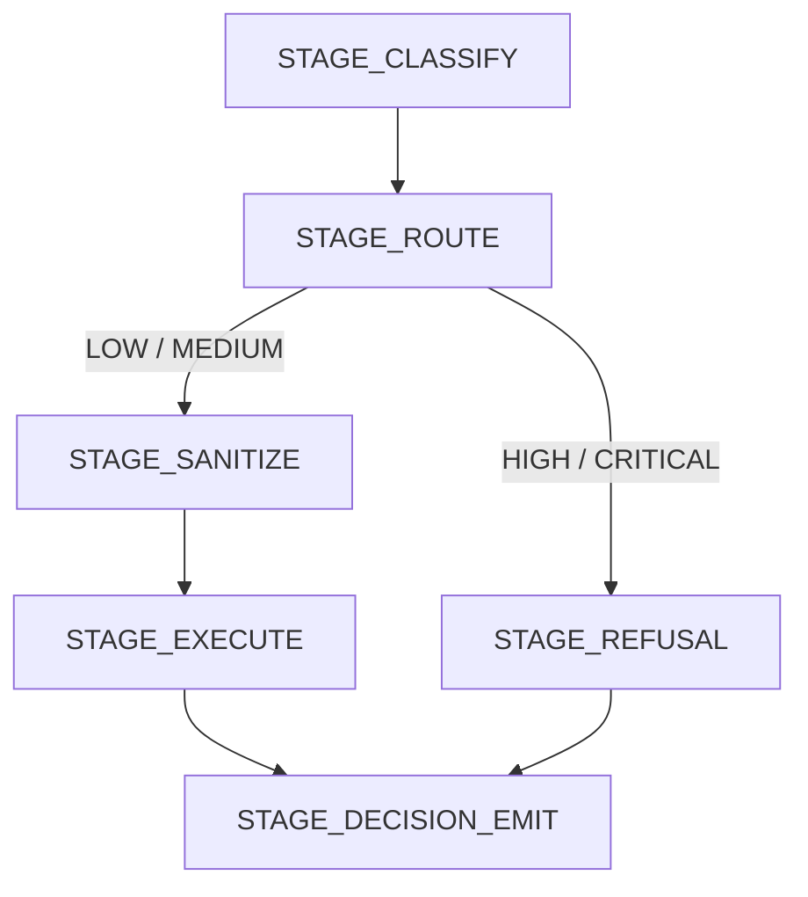

# Pipeline

Every guarded request runs through the same 12-stage execution model. That gives the project one consistent place to validate inputs, classify risk, transform sensitive spans, decide whether to continue, and capture observability data.

## Stage Map

## What Each Stage Does

| Stage | Purpose | Typical outputs |
| --- | --- | --- |
| `validate` | Enforces request shape, config sanity, and boundary rules | contract-safe `GuardInput` |
| `defend` | Captures intent context for later fidelity checks | `IntentLock` or no-op |
| `classify` | Runs inspectors and detectors | `Finding[]` |
| `deception_inspect` | Scores multi-turn manipulation or drift | updated conversation risk |
| `sanitize` | Applies placeholder mapping or other safe transforms | transformed text + placeholder map |
| `route` | Resolves policy and risk bands | `PolicyDecision[]`, action |
| `execute` | Applies strategies and calls the downstream backend when allowed | backend call or transformed output |
| `refusal` | Assembles structured refusals for `HIGH` and `CRITICAL` outcomes | `RefusalEnvelope` |
| `verify` | Scores output fidelity against the captured intent | fidelity verdict |
| `rehydrate` | Reintroduces original values when safe | user-facing output |
| `decision_emit` | Builds audit-safe decision records | `DecisionRecord` |
| `report` | Flushes reporters and observability side effects | logs, metrics, traces, lifecycle events |

## Request Outcomes

- `pass`: no relevant findings, or risk is below intervention thresholds.
- `redact`: sensitive spans are transformed before the backend sees them.
- `warn`: content continues, but policy records include elevated rationale.
- `block`: the request exits through structured refusal and the backend is never called.

## Example Outcome Split

## Instrumentation Pattern

Every stage is wrapped by a shared runner that emits lifecycle events, logs, metrics, and traces in a consistent pattern. That means adding a new stage does not require duplicating observability boilerplate.

For an interactive version of this model, open [Pipeline Swimlane](/canvases/pipeline-swimlane).