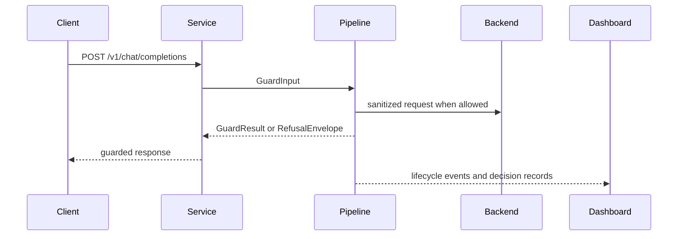

# API Service

`arc-guard-service` exposes the guard pipeline through a thin FastAPI layer. It owns transport, request IDs, CORS, and dashboard read routes, but the core guardrail logic still lives in the runtime package.

## Primary Routes

| Route | Purpose |
| --- | --- |
| `POST /v1/chat/completions` | OpenAI-compatible chat-completions guard surface |
| `POST /v1/guard` | Legacy neutral guard endpoint retained as a tombstone surface |
| `GET /events` | Server-Sent Events stream for lifecycle events |
| `GET /requests` | Paginated dashboard request explorer |
| `GET /requests/{rid}` | Request workspace manifest |
| `GET /requests/{rid}/decision` | Stored decision record envelope |
| `GET /requests/{rid}/debug` | Paginated structured debug entries |

## Request Lifecycle

## Service Responsibilities

- Mint and propagate a request ID for correlation.
- Validate transport-level payload shapes.
- Convert transport payloads into `GuardInput`.
- Stream lifecycle events to SSE clients.
- Expose request, decision, and debug read surfaces for operators.

## Settings Highlights

| Setting area | Examples |
| --- | --- |
| Bind and port | service host and port |
| CORS | explicit dashboard origin allow-list |
| Dashboard paging | max page sizes for request and debug views |
| Lifecycle capture | payload capture flags and queue capacities |

## CORS Posture

The service uses an allow-list model rather than wildcard origins. Dashboard reads are intentionally constrained to `GET` and `OPTIONS`, and an empty origin list means no dashboard CORS surface is opened by default.