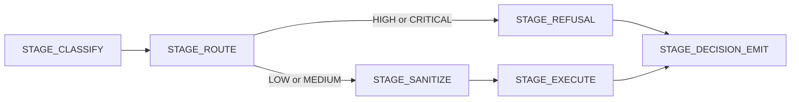

# Detection Coverage

The runtime combines fast pattern-based detectors with optional semantic and multi-turn analysis. Inspectors run independently, so one detector failing does not suppress the rest of the chain.

## Threat Categories

| Category | Primary detector | Default action |
| --- | --- | --- |
| Prompt injection | Regex injection inspector | block |
| PII and PCI | Presidio NER inspector | redact |
| Jailbreak heuristics | Rule-based jailbreak detector | block |
| Jailbreak ML | ML-backed jailbreak detector | block |
| Deception and social engineering | Conversation-turn inspector | block |
| Semantic policy violations | Semantic content policy | block |
| SQL injection | SQL injection inspector | redact |
| Shell injection | Shell injection inspector | redact |
| Template injection | Template injection path | redact |

## Detection-to-Decision Flow

## Behavior Notes

- Pattern-based inspectors remain the fastest path and cover canonical prompt injection, SQL, and shell payloads.
- Presidio handles common PII and PCI entities, while semantic extras add intent-level reasoning when installed.
- Jailbreak detection can run as both heuristic and ML-backed layers; they are additive rather than mutually exclusive.
- Multi-turn deception scoring runs in its own stage, separate from single-turn inspectors.

## Known Boundaries

- Encoded or heavily obfuscated prompt-injection content is harder for heuristic detectors than direct override language.
- Paraphrased or indirect PII forms are weaker matches for standard NER models.
- Scope matters: the pipeline is designed around guarded request content, not arbitrary upstream storage or system-prompt sources.