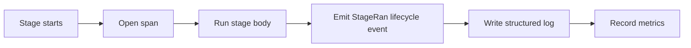

# Observability

arc-guardrails treats observability as four sibling surfaces, not one monolithic subsystem. Each surface is a protocol with its own default no-op implementation and independent failure posture.

## Surfaces

| Surface | Protocol | Default | Purpose |
| --- | --- | --- | --- |
| Logger | `Logger` | `NullLogger` | Structured per-stage logs |
| Tracer | `Tracer` | `NullTracer` | Span-oriented tracing |
| MetricSink | `MetricSink` | `NullMetricSink` | Counters and latency histograms |
| LifecycleSink | `LifecycleSink` | `NullLifecycleSink` | Typed event stream for replay and dashboards |

## Shared Stage Emission Pattern

Every stage gets the same instrumentation pattern through a shared runner, which keeps observability behavior consistent across the pipeline.

## Failure Posture

| Situation | Posture |
| --- | --- |
| Inspector fails | Fail-open |
| Reporter or logger fails | Fail-open |
| Lifecycle sink fails | Fail-open |
| Sanitization strategy fails | Fail-closed |
| Policy router fails | Fail-closed |
| Rehydration verifier fails | Fail-closed-conservative |

## Payload Safety

The default posture is to keep raw sensitive strings out of telemetry. Decision records, lifecycle events, and observability hooks are designed to preserve auditability without copying raw PII or attack payloads into secondary channels.

## Service-Level Observability Outputs

- SQLite-backed lifecycle storage for replay and dashboards
- SSE event streaming for live request monitoring
- Structured debug entry capture per request ID
- Optional OTEL adapters for environments that already run tracing and metrics infrastructure