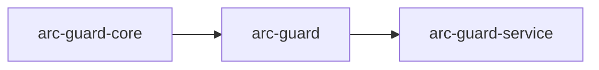

# Packages

The repository is organized around a strict dependency direction: the contract layer sits at the bottom, the batteries-included runtime depends on it, and the service layer depends on both.

## Responsibilities

| Package | Contains | Does not contain |
| --- | --- | --- |
| `arc-guard-core` | Typed models, Protocols, lifecycle events, stage constants, exceptions, placeholder registry | Heavy provider-specific dependencies or transport code |
| `arc-guard` | Full `GuardPipeline`, built-in inspectors and strategies, lifecycle sinks, semantic helpers, OTEL integration, evaluation utilities | HTTP transport and dashboard route handling |
| `arc-guard-service` | FastAPI routes, request settings, SSE events, dashboard read surfaces, request IDs | Guardrail rules or detection logic |
| `apps/guardrail-flow` | Browser-based operator dashboard | Python runtime or transport logic |

## Important Directories

- `packages/core/src/arc_guard_core`: contracts and stable data model
- `packages/pip/src/arc_guard`: runtime pipeline, inspectors, strategies, middleware, observability
- `packages/api/src/arc_guard_service`: service transport, events, and request surfaces
- `apps/guardrail-flow/src`: operator dashboard views and flow tooling

## Optional Runtime Extras

| Extra | Adds |
| --- | --- |
| `[semantic]` | Embedding-backed intent and policy components |
| `[jailbreak-ml]` | ML-backed jailbreak classification |
| `[otel]` | OpenTelemetry metric and trace adapters |
| `[fastapi]` | Service transport runtime for the API package |

This split keeps the stable contract smaller than the total runtime implementation, which is important for downstream compatibility and lightweight integrations.