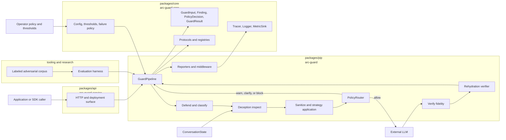
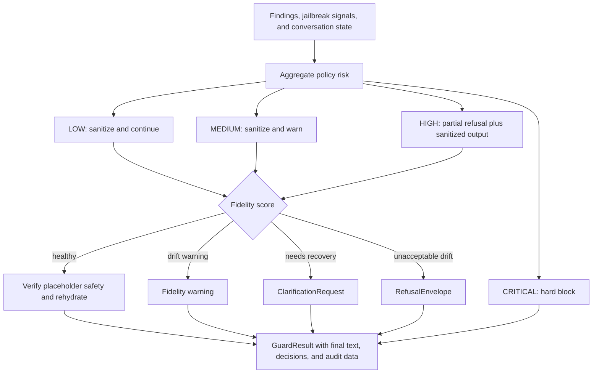
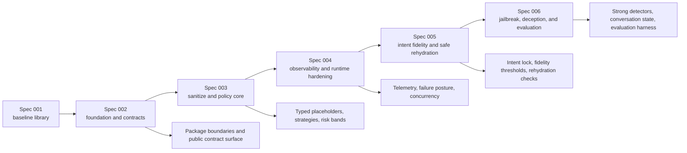

# Walkthrough — System Canvas

This page is the visual companion to [system-overview.md](./system-overview.md). It keeps the same architecture model but compresses it into diagrams that show package boundaries, request flow, and the decision ladder in one place.

## 1. Architecture canvas

## 2. Decision canvas

## 3. Spec ownership canvas

## How to use this canvas

- Read [system-overview.md](./system-overview.md) first when you want the narrative explanation.
- Use this page when you need the whole architecture at a glance for review, planning, or discussion.
- Jump into the per-spec walkthroughs for the detailed behavior owned by each slice.
