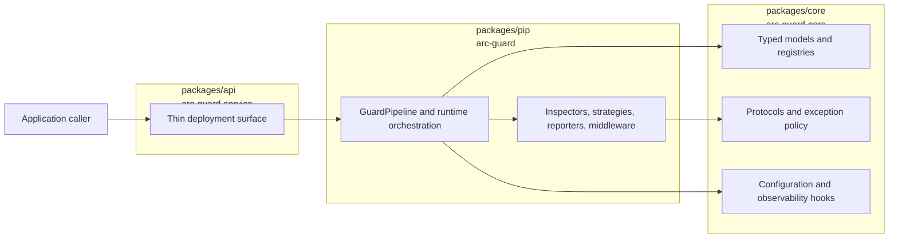
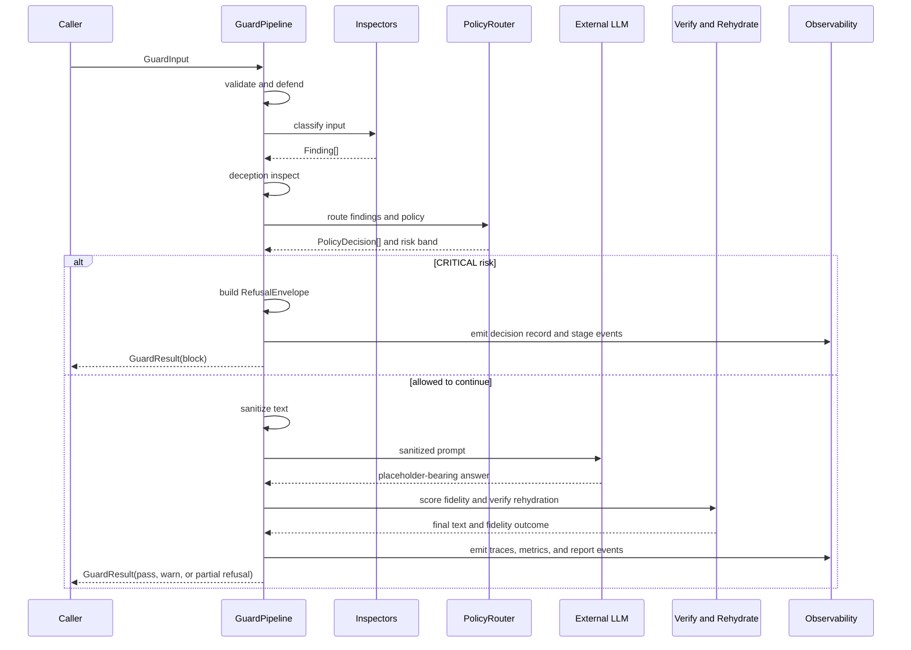

# Walkthrough — System Overview

This page is the consolidated walkthrough of how the `arc-guardrails` system works across the current spec set. It does not replace the per-spec pages in this folder; it compresses them into one end-to-end explanation so a reader can understand the whole system without jumping between Specs 001 through 006.

For a diagram-heavy companion, see [system-canvas.md](./system-canvas.md).

## What the system is for

The system is an **intent-preserving guardrail pipeline** for external LLM use. Its job is not only to mask sensitive content or block unsafe prompts. It also tries to preserve the user's underlying intent so the final answer stays useful after sanitization, verification, and safe rehydration.

The architecture is organized around three measurable outcomes:

- **Privacy preservation**: detect and transform sensitive entities before they leave the trusted boundary.
- **Adversarial resistance**: detect jailbreaks, prompt injection patterns, and multi-turn deception before unsafe instructions reach the model.
- **Semantic fidelity**: verify that the answer still matches the user's original request after sanitization and before rehydration.

Specs 001 through 006 progressively define that system:

| Spec                                        | What it contributes                                                                          |
| ------------------------------------------- | -------------------------------------------------------------------------------------------- |
| [001](./001-arc-guard-rails.md)             | Baseline in-process Python guardrail library and protocol-first pipeline shape               |
| [002](./002-rewrite-foundation.md)          | Package split, stable contracts, validation rules, migration path                            |
| [003](./003-sanitization-policy-core.md)    | Typed-placeholder sanitization, policy routing, risk bands, refusal and clarification flows  |
| [004](./004-observability-runtime.md)       | Stage instrumentation, failure posture rules, payload-safe telemetry, concurrency guarantees |
| [005](./005-intent-fidelity-rehydration.md) | Intent capture, fidelity scoring, verified rehydration, intent-lock audit binding            |
| [006](./006-jailbreak-deception-eval.md)    | Strong jailbreak detection, multi-turn deception tracking, comparative evaluation harness    |

## Package map

The rewrite moves the system into three explicit packages under `packages/`.

| Package          | Distribution        | Responsibility                                                                                                                                           |
| ---------------- | ------------------- | -------------------------------------------------------------------------------------------------------------------------------------------------------- |
| `packages/core/` | `arc-guard-core`    | Provider-neutral contract layer: typed models, Protocols, configuration schemas, exception hierarchy, registries, stage descriptors, observability hooks |
| `packages/pip/`  | `arc-guard`         | Batteries-included runtime library: concrete inspectors, strategies, pipeline orchestration, middleware, reporters, optional adapters and extras         |
| `packages/api/`  | `arc-guard-service` | Thin deployment surface that consumes the contracts and runtime library without owning guardrail logic                                                   |

Import direction is intentionally one-way:

```text
arc_guard_service  ->  arc_guard  ->  arc_guard_core
```

That boundary is load-bearing. `core` stays dependency-light and provider-neutral, `pip` owns behavior, and `api` remains a delivery surface rather than a second implementation layer.

### Visual package view



## Core building blocks

The system works because a small set of public entities cross every important boundary.

| Entity                 | Role in the system                                                                                                               |
| ---------------------- | -------------------------------------------------------------------------------------------------------------------------------- |
| `GuardInput`           | Request entering the guardrail pipeline; carries text, context, and policy hints                                                 |
| `Finding`              | A single detected issue such as PII, injection, jailbreak evidence, or other policy-relevant signal                              |
| `PolicyDecision`       | The chosen response for a finding or group of findings, including strategy and rationale                                         |
| `GuardResult`          | Final pipeline outcome: transformed text, action, findings, decisions, refusal, clarification, fidelity fields, and run metadata |
| `RefusalEnvelope`      | Structured explanation returned when the system blocks or partially refuses a request                                            |
| `ClarificationRequest` | Structured recovery path when the system needs the caller to reformulate rather than accept or block                             |
| `DecisionRecord`       | Audit summary for the whole run; records what happened without exposing raw payload text                                         |
| `FidelityScore`        | Semantic score describing how well the answer still matches the captured user intent                                             |
| `ConversationState`    | Multi-turn deception state carried between calls for conversational defense                                                      |

The main extension points are Protocols defined in `core` and implemented in `pip`:

| Protocol                    | What it lets the system swap or extend                                        |
| --------------------------- | ----------------------------------------------------------------------------- |
| `Guard`                     | The top-level pre-process, post-process, and end-to-end orchestration surface |
| `Inspector`                 | Detection components that produce `Finding` objects                           |
| `ActionStrategy`            | Transformations such as redact, hash, tokenize, warn, or block                |
| `PolicyRouter`              | Mapping from findings and policy rules to concrete `PolicyDecision` outputs   |
| `Reporter`                  | Emission of audit or operational events                                       |
| `FlagProvider`              | Runtime feature flags or policy switches                                      |
| `IntentEncoder`             | Semantic representation of a prompt or answer for fidelity checking           |
| `FidelityScorer`            | Similarity scoring between captured intent and candidate answer               |
| `RehydrationVerifier`       | Safety gate that decides whether placeholder reinsertion is allowed           |
| `JailbreakDetector`         | Strong jailbreak categorization beyond simple pattern checks                  |
| `ConversationTurnInspector` | Multi-turn deception scoring across a running conversation                    |

## End-to-end request lifecycle

The spec set converges on one request lifecycle. Some stages are always active, some are conditional, but the model is stable.

```text
validate
  -> defend
  -> classify
  -> deception_inspect
  -> sanitize
  -> route
  -> execute
  -> verify
  -> rehydrate
  -> decision_emit
  -> report
```

### Lifecycle diagram



### 1. Validate

The pipeline first validates the incoming request and its configuration. Bad payload shapes, invalid thresholds, unknown rule references, and cross-field config errors fail here before any detection or model call runs.

This stage exists to keep the rest of the system refactor-safe. The contracts are strict so later features can evolve without silently passing malformed data between layers.

### 2. Defend

The defend stage captures the information needed for intent preservation and advanced safety checks. In the full system this is where semantic intent capture starts, and where early attack-oriented signals can be recorded before any text transformation changes the evidence.

This stage matters because later fidelity scoring depends on comparing the original request intent against the final answer, not only against the sanitized prompt.

### 3. Classify

Inspectors analyze the input and emit `Finding` objects. This is the detection layer for:

- sensitive entities,
- prompt injection markers,
- enterprise-specific patterns,
- semantic or model-backed findings when optional extras are enabled,
- jailbreak evidence and other safety signals.

Each inspector contributes evidence, but inspectors do not decide the final action. That separation keeps detection independent from policy.

### 4. Deception Inspect

When conversational defense is enabled, the system reads and updates `ConversationState` to detect gradual policy erosion, role-play coercion, and other multi-turn attack patterns that are weak on any single turn but strong in aggregate.

The output is another signal into policy routing, not a second isolated guard path.

### 5. Sanitize

Sanitization transforms detected sensitive spans into typed placeholders or other configured forms. This is where the rewrite deliberately avoids generic masking and instead preserves structure with labels such as `[CUSTOMER_NAME]` or `[CREDIT_CARD_2]`.

The important feature here is that sanitization is **typed** and **policy-driven**:

- typed placeholders preserve meaning for downstream generation,
- numbering rules preserve repeated-entity structure,
- alternate strategies like hash or tokenize support analytics and controlled reference behavior,
- block remains available for entities or findings that must not proceed.

### 6. Route

The policy router evaluates the set of findings and chooses the winning response per finding and for the run as a whole. This is where per-entity rules, precedence, and aggregate risk bands become operational.

The system uses four main risk bands:

| Risk band | Behavior                                                                 |
| --------- | ------------------------------------------------------------------------ |
| LOW       | Sanitize and continue                                                    |
| MEDIUM    | Sanitize and warn                                                        |
| HIGH      | Partial refusal with sanitized output plus a structured refusal envelope |
| CRITICAL  | Hard block with a refusal envelope and no released text                  |

The route stage also decides whether a clarification path is better than a flat refusal when the risk is ambiguous but recoverable.

### 7. Execute

If the policy outcome allows the request to continue, the sanitized prompt is sent to the external LLM or other downstream system. The SDK itself does not make unsafe raw content leave the trusted boundary; it sends the transformed prompt produced by earlier stages.

This separation is what lets the system preserve privacy without losing the rest of the user task.

### 8. Verify

After generation, the system evaluates whether the answer still aligns with the captured user intent. The `IntentEncoder` and `FidelityScorer` Protocols make that check pluggable, while the contract keeps the output stable through `FidelityScore` and threshold-driven actions.

The fidelity ladder is intentionally graduated:

- high fidelity: continue normally,
- moderate drift: warn,
- stronger drift: ask for clarification,
- unacceptable drift: refuse instead of returning a misleading answer.

Risk posture still wins over fidelity. If the request already hit a block-worthy security threshold, fidelity does not override that decision.

### 9. Rehydrate

Rehydration is not blind placeholder substitution. The `RehydrationVerifier` checks that reinserting original values is structurally and semantically safe.

The verifier's role is to answer questions such as:

- does every placeholder in the candidate answer correspond to a known sanitized entity,
- did the answer preserve the surrounding structure closely enough to trust reinsertion,
- does rehydrating the answer create new unsafe content or restore an attack path.

Only if those checks pass does the system return the fully rehydrated answer. Otherwise it can keep placeholders in place or perform a partial rehydration.

### 10. Decision Emit

Every run produces a `DecisionRecord`. This is the audit object that binds together findings, policy decisions, outcome, and the intent lock without storing raw payload content in telemetry.

That record is important for both enterprise review and research claims because it shows what the guardrail did, why it did it, and whether fidelity held.

### 11. Report

The last stage sends stage events, metrics, traces, and reporter outputs through the configured hooks. Reporters and telemetry sinks are intentionally non-authoritative side channels: if a reporter fails, the request outcome should not change unless policy explicitly requires otherwise.

## Feature walkthrough by subsystem

### Detection and classification

The system's detection layer is modular. It can combine simple pattern detectors, Presidio-backed entity extraction, enterprise custom registries, strong jailbreak detectors, semantic encoders, and conversation-state inspectors in one run.

The important design choice is that all of these collapse into typed `Finding` or score objects. That keeps later routing and auditing stable even as the detector mix changes.

### Policy routing and strategies

Routing is where the system becomes enterprise-ready instead of remaining a simple allow-or-block filter. Multiple findings can map to different strategies in the same run, and precedence rules settle conflicts consistently.

Built-in strategies include:

| Strategy   | Purpose                                                 |
| ---------- | ------------------------------------------------------- |
| `redact`   | Replace spans with typed placeholders                   |
| `hash`     | Pseudonymize sensitive spans for analytics or joins     |
| `tokenize` | Preserve distinct references across repeated entities   |
| `warn`     | Preserve content while elevating the decision rationale |
| `block`    | Stop processing and trigger refusal behavior            |

This strategy model is one of the core reasons the architecture scales beyond a toy filter.

### Refusal and clarification behavior

The system does not treat every unsafe or uncertain case as a dead-end block. It can return a `RefusalEnvelope` that explains what triggered the decision, what policy fired, and what the caller should do next. When the situation is recoverable, it can return a `ClarificationRequest` instead.

That matters for real integrations because operators need machine-readable decisions, and end users need a path forward that is more useful than a generic denial.

### Observability and runtime hardening

Observability is part of the product contract rather than optional afterthought. Each stage emits spans, events, and metrics, and each failure class has a documented posture:

- fail-open where losing a detector is safer than blocking all traffic,
- fail-closed where a broken transformation or routing decision cannot be trusted,
- fail-closed-conservative where the system should continue only with a safe default.

Runtime hardening also includes:

- immutable contract objects,
- frozen registries after pipeline construction,
- explicit sync and async ownership,
- offloading blocking work away from the event loop,
- payload-safe telemetry that never stores raw request content in logs or metrics.

### Intent fidelity and safe rehydration

This is the research differentiator. The system captures intent before sanitization, measures drift after generation, and only rehydrates when the answer remains both safe and semantically aligned.

The intent lock recorded in `DecisionRecord` binds:

- the original prompt representation,
- the sanitized prompt representation,
- the rehydrated answer representation.

That gives reviewers a way to reason about whether the system preserved meaning rather than only suppressing content.

### Jailbreak and deception resistance

The security posture extends beyond regex-based prompt injection checks. The spec set adds stronger jailbreak categories, stateful deception scoring, and thresholds that can escalate from warning to clarification to refusal.

This is where the system addresses attack styles such as:

- direct instruction override,
- role-play coercion,
- hypothetical framing used to bypass policy,
- slow multi-turn escalation,
- indirect injection hidden in earlier context.

### Evaluation harness

The evaluation harness exists so the system can be measured instead of described only qualitatively. The documented comparison set includes:

| Configuration                           | What it demonstrates                                       |
| --------------------------------------- | ---------------------------------------------------------- |
| `raw`                                   | Baseline behavior without guardrailing                     |
| `sanitize_only`                         | Privacy-preserving transformation without stronger defense |
| `sanitize_plus_jailbreak`               | Added adversarial resistance                               |
| `sanitize_plus_jailbreak_plus_fidelity` | Full target behavior with semantic verification            |

The harness is meant to report both protection and usefulness metrics, including detection quality, refusal and clarification rates, fidelity behavior, and latency overhead.

## Operational rules that shape the whole system

Several rules recur across every spec because they define how the system must behave under stress:

1. Validate data at every important boundary.
2. Keep `core` provider-neutral and dependency-light.
3. Express cross-package seams as Protocols, not concrete classes.
4. Record policy outcomes in typed objects rather than passing loose dictionaries.
5. Never leak raw payload text into logs, traces, metrics, or audit records.
6. Make blocking work explicit and keep it off the asyncio event loop.
7. Prefer reuse-before-build for runtime dependencies and adapters.

These are not documentation niceties. They are the rules that let the package split, policy routing, telemetry, and research features coexist without collapsing into an untestable monolith.

## How to read the rest of the walkthrough folder

Use this page for the system story. Use the per-spec pages when you need the focused details for one slice:

- [001 — arc-guard-rails](./001-arc-guard-rails.md): baseline architecture and original package intent
- [002 — Rewrite Foundation](./002-rewrite-foundation.md): package split, contract boundaries, migration path
- [003 — Sanitization and Policy Core](./003-sanitization-policy-core.md): placeholder registry, strategy model, risk bands, clarification flow
- [004 — Observability and Runtime Hardening](./004-observability-runtime.md): stage instrumentation, failure posture, concurrency, OTEL
- [005 — Safe Rehydration and Intent Fidelity](./005-intent-fidelity-rehydration.md): fidelity scoring, threshold ladder, verified rehydration
- [006 — Jailbreak, Deception, and Evaluation](./006-jailbreak-deception-eval.md): strong detectors, conversation state, evaluation harness

Taken together, those documents describe one coherent system: a provider-neutral guardrail core, a composable runtime library, and a deployment surface that can protect external LLM calls while preserving intent, privacy, and traceable safety decisions.
