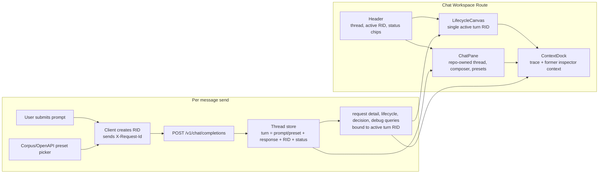

# Chat Workspace Plan

## Objective

Build a new chat-first workspace screen that reuses the current request workspace strengths:

- support continuous conversation testing as a real chat session
- post directly to the existing `POST /v1/chat/completions` surface
- provide an operator option to send a predefined OpenAPI / corpus example from the chat UI
- keep the lifecycle canvas as the central observability surface
- replace the right-side Inspector with a proper AI chat window
- move current Inspector context into the bottom dock so the lower area becomes the single place for trace plus request context
- let each chat send create or bind to a request RID so the canvas and dock can show how that turn behaved through the guard pipeline

This document is a plan only. It does not implement the screen yet.

## Current State

### Existing request workspace

- Route: `apps/guardrail-flow/src/routes/workspace.tsx`
- Layout:
  - center: `LifecycleCanvas`
  - right: `Inspector`
  - bottom: `DebugDock`
- State source:
  - `useUiStore` stores selected node, inspector tab, dock tab, collapsed state, and dock height
- Inspector tabs today:
  - `stage`
  - `decision`
  - `policy`
  - `payload`
  - `json`
- Debug dock tabs today:
  - `lifecycle`
  - `logs`
  - `backend`
  - `diff_replay`

### Existing frontend API posture

- Dashboard is read-heavy today.
- `apps/guardrail-flow/src/lib/api/client.ts` only exposes read endpoints for:
  - request detail
  - lifecycle replay
  - decision
  - debug
  - explorer list
- There is no chat mutation hook or POST transport in the frontend yet.

### Existing backend RID behavior

- `POST /v1/chat/completions` resolves an RID in the backend.
- The RID is derived from `X-Request-Id` when supplied, otherwise the server generates one.
- The current OpenAI-compatible body does not obviously return the RID in the JSON response.

## Core Product Decision

### New screen

Add a separate chat workspace route rather than overloading the current `/requests/:rid` route.

Recommended route shape:

- `/chat`
- optional later extension: `/chat/:threadId`

Reasoning:

- `/requests/:rid` remains the single-request forensic view
- `/chat` becomes the multi-turn operator lab
- this avoids mixing one-RID assumptions with multi-turn conversation behavior

## Recommended Chat Approach

### Primary v1 choice

Build the chat pane with the existing `shadcn/ui` stack and repo-owned chat components.

Why this is the right default for v1:

- the app already has the primitives needed for a production-grade operator chat pane: panels, buttons, tabs, inputs, badges, separators, scroll areas, and state handling
- the hard part of this screen is not generic chat bubbles; it is binding every turn to an RID, canvas state, debug state, and dock context
- the screen needs custom operator affordances like RID chips, replay-friendly turn selection, and “send a preset corpus example” actions
- a repo-owned pane keeps styling, shell reuse, and behavior aligned with the current workspace route

### When a dedicated chat library becomes justified

Evaluate `assistant-ui` later only if the chat surface grows into a broader product surface with needs like:

- rich streaming token UX
- attachments
- message editing or branching
- built-in tool rendering or agent UI
- persistent multi-thread chat management beyond a single operator session

### Transport strategy

Use a repo-owned transport adapter against the existing `POST /v1/chat/completions` endpoint.

Recommended plan:

- keep the chat UI repo-owned in v1
- add a dedicated frontend mutation for `POST /v1/chat/completions`
- attach client-generated `X-Request-Id` headers so each turn can drive canvas and debug queries deterministically
- optionally revisit `@ai-sdk/react` later if streaming or richer assistant interaction patterns become important enough to justify a transport abstraction layer

Reasoning:

- current backend contract is OpenAI-compatible and already sufficient for a first send path
- no new chat dependency is required to meet the clarified product need
- the existing ecosystem stays simpler while we validate the screen concept

## UX Intent

### Target screen behavior

- right side is a full AI chat pane
- center canvas still shows pipeline execution for the active turn
- bottom dock becomes the single context tray for both trace and former inspector context
- every message send should produce a traceable request RID and a corresponding canvas/debug story

### Important UX rule

Do not overlay multiple RIDs on the same lifecycle graph in v1.

Instead:

- each chat turn owns one RID
- the chat thread keeps the turn history
- selecting a turn in chat retargets the canvas and dock to that turn's RID
- the newest in-flight or newest completed turn is selected by default

That keeps the canvas readable while still showing every POST request from the chat session.

## Target Layout



## Proposed Screen Anatomy

### Header

Keep a workspace-style header, but shift it from single-request wording to session wording.

Suggested header content:

- back link to `/requests`
- chat workspace title
- active turn RID
- active turn status badge
- final action badge when available
- duration chip when available

### Center canvas

Keep `LifecycleCanvas` and do not redesign its core interaction model.

Changes:

- bind it to the selected chat turn RID instead of the route RID
- when the selected turn is live, continue using SSE follow behavior for that RID
- show only the necessary request story for that turn
- optionally add a compact turn switcher or active-turn chip row above the canvas in a later phase

### Right chat pane

Replace `Inspector` entirely with a `ChatPane`.

Suggested capabilities:

- threaded message list
- assistant and user message bubbles
- composer with send and stop controls
- preset launcher for corpus / OpenAPI examples exposed by the backend
- per-turn metadata chips:
  - RID
  - status
  - final action
  - duration
- click a turn to activate its canvas and dock context
- error and retry affordances at the turn level

### Prompt presets / Swagger examples

The “send the same prompt from Swagger” requirement is feasible, but the stable source of truth should be the backend corpus examples, not a transient Swagger UI row number.

Important clarification:

- the backend examples are loaded from `arc_guard_service.examples_loader.OPENAPI_EXAMPLES`
- Swagger displays those examples, but a visual number like “141” is not a robust product identifier for the frontend
- the chat UI should refer to the canonical example id plus summary, not a Swagger screen position

Recommended UX:

- add a `Try example` button near the chat composer
- open a searchable preset sheet or popover
- list examples by summary, inspector family, difficulty, and expected action
- insert or immediately send the chosen example through the same `POST /v1/chat/completions` path as a normal chat turn

Recommended backend support:

- add a lightweight read endpoint that exposes the validated corpus/OpenAPI examples to the dashboard
- keep the backend corpus as the only source of truth so Swagger and chat presets cannot drift

### Bottom context dock

Evolve `DebugDock` into a broader `ContextDock` instead of adding nine flat tabs.

Recommended grouped tab structure:

- Group 1: `Trace`
  - `lifecycle`
  - `logs`
  - `backend`
  - `diff_replay`
- Group 2: `Request Context`
  - `stage`
  - `decision`
  - `policy`
  - `payload`
  - `json`

Reasoning:

- moving inspector tabs into the dock should not create a single overcrowded tab bar
- two-level dock navigation preserves scanability
- former inspector panels already exist and can mostly be reused

## Data Model Plan

### New frontend chat-turn model

Add a UI model dedicated to the chat screen.

Suggested shape:

```ts
type ChatTurnStatus = 'draft' | 'sending' | 'streaming' | 'completed' | 'error';

interface ChatTurn {
  localId: string;
  rid: string;
  userMessage: string;
  assistantMessage: string | null;
  source: 'manual' | 'preset';
  presetId: string | null;
  startedAt: string;
  status: ChatTurnStatus;
  finalAction: FinalAction | null;
  durationMs: number | null;
  errorMessage: string | null;
}
```

### RID ownership rule

The client should generate the RID for each send and attach it via `X-Request-Id`.

Why:

- lets the UI know the RID before the response returns
- removes ambiguity if the response body does not expose RID
- allows immediate query fan-out for request detail, lifecycle, decision, and debug

### Backend contract impact

Phase 1 can work without a backend response schema change if the server respects `X-Request-Id` consistently.

Recommended hardening for later:

- return RID explicitly in a response header and/or typed envelope metadata
- document that contract for dashboard clients

## Component Refactor Plan

### New route and screen shell

Add:

- `apps/guardrail-flow/src/routes/chat-workspace.tsx`

Responsibilities:

- own the chat thread state
- own the selected active turn RID
- send chat mutations
- fan out request-scope queries for the active RID
- render shared workspace shell pieces

### New chat components

Add a chat component area, for example:

- `src/components/chat/ChatPane.tsx`
- `src/components/chat/ChatMessageList.tsx`
- `src/components/chat/ChatComposer.tsx`
- `src/components/chat/TurnMetaBar.tsx`
- `src/components/chat/PromptPresetPicker.tsx`

All of these should be repo-owned in v1.

### Shared workspace shell extraction

Refactor the current request workspace so shared pieces can be reused.

Likely extraction targets:

- header badge cluster
- canvas container
- dock shell

This avoids copying `workspace.tsx` and then letting the two screens drift.

### Dock refactor

Change:

- `src/components/workspace/DebugDock.tsx`

Into either:

- a renamed `ContextDock.tsx`, or
- a `DebugDock` that supports grouped tabs and former inspector panels

### Inspector reuse strategy

Do not delete the current inspector tab bodies.

Instead:

- keep `StageTab`, `DecisionTab`, `PolicyTab`, `PayloadTab`, and `JsonTab`
- mount them in the dock's `Request Context` group
- retire only the right-side `Inspector` container for the new chat route

## API and Hook Changes

### New API client methods

Extend `DashboardApi` and both live/fixture clients with a chat send method.

Suggested additions:

- `sendChatCompletion(...)`
- `listChatExamples(...)`
- optional later `listChatThreads(...)` or `getChatThread(...)`

### New hook

Add a dedicated mutation hook, for example:

- `src/hooks/useChatTurnMutation.ts`

Responsibilities:

- generate RID
- attach `X-Request-Id`
- send `POST /v1/chat/completions`
- manage optimistic turn state
- handle retry and cancellation semantics

### Example manifest hook

Add a dedicated read hook, for example:

- `src/hooks/useChatExamplesQuery.ts`

Responsibilities:

- fetch the backend-exposed corpus/OpenAPI examples manifest
- support grouping by inspector and difficulty
- provide data for the preset picker near the composer

### Query fan-out after send

After a turn starts:

- mark turn `sending`
- set selected RID immediately
- query request detail
- query lifecycle replay
- query decision when available
- query debug logs when the user opens those tabs

## State Plan

### Extend UI store

The current store assumes one selected node, one inspector tab, and one dock tab.

For the chat route, likely additions are:

- selected chat turn RID
- chat route pane collapse state if needed
- dock group selection in addition to dock tab selection

Potential type changes:

- replace `InspectorTab` usage on the new screen with `ContextDockTabGroup`
- keep current `InspectorTab` union because the former tabs still exist as content types

## Canvas Behavior Rules

### What the canvas should show

- only the selected turn RID
- stage progression for that turn
- playback and spread controls exactly as today
- active/live follow when that selected turn is still in flight

### What the canvas should not do in v1

- overlay multiple turns on one graph
- act as the message transcript
- duplicate inspector JSON/payload content in the center panel

That keeps the canvas focused on “how this request behaved,” not “everything the user ever sent.”

## Phased Implementation Plan

### Phase 1: route and shell

- add `/chat` route in `src/main.tsx`
- extract reusable workspace shell pieces from `workspace.tsx`
- build `ChatWorkspaceRoute` with placeholder chat pane and reused canvas/dock

### Phase 2: chat pane

- build the chat pane with repo-owned shadcn-based components
- add thread, messages, composer, and preset picker
- add turn model and active-turn selection behavior

### Phase 3: mutation and RID binding

- add chat mutation client method
- add examples manifest read method
- generate client RID per send
- query request-scoped observability surfaces from that RID

### Phase 4: dock migration

- move former Inspector content into grouped dock tabs
- keep existing debug surfaces intact
- remove the right-side Inspector from the chat route

### Phase 5: polish and reliability

- retry and cancellation behavior
- empty, loading, and partial-data states
- fixture-mode story for chat route
- focused contract and render tests

## Files Likely To Change

### Add

- `scratch.md`
- `apps/guardrail-flow/src/routes/chat-workspace.tsx`
- `apps/guardrail-flow/src/components/chat/*`
- `apps/guardrail-flow/src/hooks/useChatTurnMutation.ts`
- `apps/guardrail-flow/src/hooks/useChatExamplesQuery.ts`
- `apps/guardrail-flow/src/types/chat.ts`
- tests for the new route and chat pane

### Update

- `apps/guardrail-flow/src/main.tsx`
- `apps/guardrail-flow/src/lib/api/types.ts`
- `apps/guardrail-flow/src/lib/api/client.ts`
- `apps/guardrail-flow/src/components/workspace/DebugDock.tsx`
- `apps/guardrail-flow/src/components/workspace/Inspector.tsx` or its callers
- `apps/guardrail-flow/src/lib/state/ui-store.ts`
- fixture client if the route must work in fixture mode
- `packages/api/src/arc_guard_service/transport/http.py` or a sibling router module for an examples manifest endpoint
- `packages/api/src/arc_guard_service/examples_loader.py` only if we need a dedicated export shape for the dashboard

## Test Plan

### Frontend

- route render test for `/chat`
- chat pane send/retry/cancel tests
- preset picker test that injects or sends a corpus/OpenAPI example
- active-turn selection test updates canvas and dock queries
- dock group/tab tests covering former inspector content in the new dock
- empty-state and error-state coverage for the chat route

### Contract

- verify client-generated RID binds correctly to request detail and lifecycle queries
- verify a preset example and a typed chat prompt both hit the same `POST /v1/chat/completions` flow
- verify chat send still works when action or risk filters are irrelevant

### Manual validation

- send benign prompt
- send PII prompt
- send blocked prompt
- send a corpus/OpenAPI preset from the chat picker
- verify each turn gets a distinct RID
- verify selecting any turn updates canvas, badges, and dock context

## Risks

### Highest risk

- chat POST to RID linkage is the critical contract; if the client cannot deterministically own or recover RID, the whole canvas-and-dock story becomes brittle
- exposing corpus/OpenAPI examples to the dashboard without drift requires a real backend manifest endpoint, not a copied frontend list

### Secondary risks

- grouped dock UX could become dense if tab structure is not disciplined
- streaming support may require more backend or transport normalization than the current read-only dashboard does
- fixture mode will need a believable mock transport, not only static explorer fixtures
- the product language must use canonical example ids and summaries, not fragile Swagger UI ordering like “example 141”

## Open Questions

- Should `/chat` support one transient local thread only in v1, or should threads persist in the dashboard?
- Do we want the backend to echo RID in response metadata, or is client-owned `X-Request-Id` sufficient for v1?
- Should the chat route allow model selection, or inherit the deployment default only?
- Do we want the canvas to auto-follow the newest turn always, or stay pinned when the operator manually selects an older turn?
- Should the preset picker expose the full corpus, or only an allowlisted subset of high-value examples?

## Recommended v1 answers

- single local thread first
- client-owned RID via `X-Request-Id`
- no model picker in v1
- auto-follow newest turn until the operator manually pins an older one
- expose an allowlisted subset of corpus/OpenAPI examples first, then expand after we validate the UX
