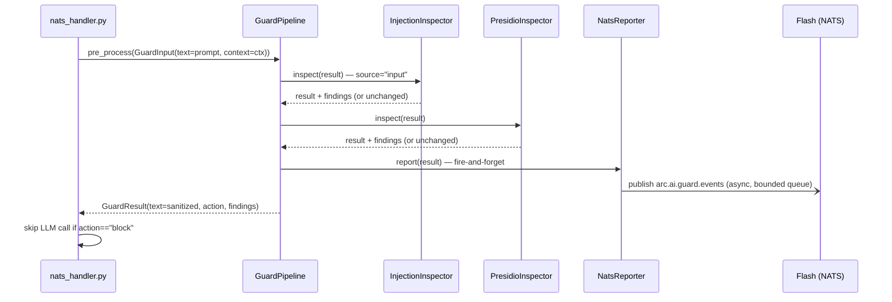

# Implementation Plan: arc-guardrails — Python Guardrails Library (RoboCop)

> **Spec**: 001-arc-guard-rails
> **Date**: 2026-03-15
> **ARD**: `.specify/docs/decisions/001-arc-guard-rails.md` (gap-fixed, implementation-ready)

---

## Summary

Build `arc-guardrails` as a new Python package at `python/arc-guardrails/src/arc_guard/` using a protocol-first, dependency-injected architecture. Seven `typing.Protocol` interfaces define every extension point; `GuardPipeline` implements the `Guard` protocol using a Chain-of-Responsibility inspector chain. Once the library is stable, migrate Sherlock's inline guard (`nats_handler.py`) to use `GuardPipeline` with `NatsReporter` and `UnleashFlagProvider` adapters.

---

## Target Modules

| Module                                           | Language     | Changes                                                            |
| ------------------------------------------------ | ------------ | ------------------------------------------------------------------ |
| `python/arc-guardrails/src/arc_guard/`           | Python 3.11+ | **New package** — full arc-guardrails library                      |
| `services/reasoner/`                             | Python       | Replace inline regex guard; add `arc-guard[nats,unleash,otel]` dep |
| `services/reasoner/service.yaml`                 | YAML         | Add `GUARD_*` env vars per profile                                 |
| `.specify/docs/decisions/001-arc-guard-rails.md` | Markdown     | Status: Draft → Approved (post-review)                             |

---

## Technical Context

| Aspect                | Value                                                                                    |
| --------------------- | ---------------------------------------------------------------------------------------- |
| Language              | Python 3.11+                                                                             |
| Package manager       | `uv`                                                                                     |
| Core deps             | `presidio-analyzer>=2.2`, `presidio-anonymizer>=2.2`, `pydantic>=2.0`                    |
| Optional extras       | `[semantic]` (torch+transformers), `[nats]`, `[unleash]`, `[webhook]`, `[otel]`, `[arc]` |
| Testing               | `pytest`, `asyncio_mode = "auto"`                                                        |
| Linting               | `ruff check` + `mypy`                                                                    |
| Key model             | `distilbert-base-uncased-finetuned-sst-2-english` (~750 MB)                              |
| Existing inline guard | `services/reasoner/src/reasoner/nats_handler.py` lines 19-28, 112, 165                   |

---

## Architecture

### Component Ownership Map

```mermaid
graph LR
    subgraph P1["Phase 1 — Foundation (sequential)"]
        T["types.py\nGuardInput/Result/Finding/..."]
        PR["protocols/\n7 typing.Protocol interfaces"]
        CFG["config.py\nGuardConfig"]
    end

    subgraph P2A["Phase 2A — Inspectors (parallel)"]
        INJ["inspectors/injection.py"]
        PRES["inspectors/presidio.py"]
        SEM["inspectors/semantic.py"]
        CUST["inspectors/custom.py"]
        REG["registry.py\nEntityRegistry"]
    end

    subgraph P2B["Phase 2B — Strategies + Reporters + Flags (parallel)"]
        RED["strategies/redact.py"]
        HASH["strategies/hash.py\nHMAC-SHA256"]
        BLK["strategies/block.py"]
        LGR["reporters/log_reporter.py"]
        NUL["reporters/null_reporter.py"]
        WHR["reporters/webhook_reporter.py"]
        SFP["flags/static_provider.py"]
        EFP["flags/env_provider.py"]
    end

    subgraph P2C["Phase 2C — Pipeline (parallel with 2A/2B)"]
        PL["pipeline.py\nGuardPipeline"]
    end

    subgraph P3["Phase 3 — Adapters + Middleware (parallel)"]
        NR["adapters/nats_reporter.py\nbounded queue"]
        UF["adapters/unleash_provider.py"]
        OT["middleware/otel.py\nOtelMiddleware"]
    end

    subgraph P4["Phase 4 — Integration (sequential)"]
        TESTS["Unit + integration tests"]
        SHER["Sherlock migration\nnats_handler.py"]
        SVC["service.yaml env vars"]
    end

    T --> PR --> P2A & P2B & P2C
    P2A --> PL
    P2B --> PL
    PL --> P3
    P3 --> P4
```



### Sherlock Wiring (post-migration)



---

## Constitution Check

| #    | Principle          | Status | Evidence                                                                                   |
| ---- | ------------------ | ------ | ------------------------------------------------------------------------------------------ |
| I    | Zero-Dep CLI       | N/A    | Python SDK — no CLI code touched                                                           |
| II   | Platform-in-a-Box  | PASS   | `service.yaml` env vars enable guard on `arc run --profile think`                          |
| III  | Modular Services   | PASS   | Adapters are optional extras; core has no platform deps                                    |
| IV   | Two-Brain          | PASS   | Python library for intelligence layer; Go CLI untouched                                    |
| V    | Polyglot Standards | PASS   | `ruff` + `mypy` + `pytest`; docstrings on public APIs only; no `Co-Authored-By` in commits |
| VI   | Local-First        | PASS   | `GUARD_MODEL_PATH` enables air-gap; `reason` Docker pre-bakes distilbert model             |
| VII  | Observability      | PASS   | `OtelMiddleware` → 5 OTEL metrics + 2 spans emitted to Friday                              |
| VIII | Security           | PASS   | HMAC-SHA256 hash; no PII in logs; fail-open; auto-generate GUARD_HASH_KEY                  |
| IX   | Declarative        | N/A    | CLI-only principle                                                                         |
| X    | Stateful Ops       | N/A    | CLI-only principle                                                                         |
| XI   | Resilience         | PASS   | Fail-open on inspector error; bounded reporter queue; middleware circuit breaker example   |
| XII  | Interactive        | N/A    | Python library, not CLI                                                                    |

---

## Project Structure

```
arc-platform/
├── python/
│   ├── arc-guardrails/
│   │   ├── pyproject.toml                     # NEW — arc-guard package metadata
│   │   ├── README.md                          # NEW — package quickstart and usage
│   │   ├── uv.lock                            # NEW — locked dev/test dependencies
│   │   ├── src/
│   │   │   └── arc_guard/
│   │   │       ├── __init__.py               # NEW — public surface: Guard, GuardPipeline, GuardInput, GuardContext, GuardResult, GuardConfig
│   │   │       ├── config.py                 # NEW — GuardConfig (pydantic model, from_env())
│   │   │       ├── types.py                  # NEW — GuardResult, Finding, RiskLevel, GuardContext, GuardInput, EntityDefinition
│   │   │       ├── pipeline.py               # NEW — GuardPipeline (implements Guard protocol)
│   │   │       ├── registry.py               # NEW — EntityRegistry (default EntityProvider impl)
│   │   │       ├── protocols/
│   │   │       ├── inspectors/
│   │   │       ├── strategies/
│   │   │       ├── reporters/
│   │   │       ├── flags/
│   │   │       ├── middleware/
│   │   │       └── adapters/
│   │   └── tests/
│   └── arc-common/
│       ├── pyproject.toml                    # Shared Python support package metadata
│       └── src/
│           └── arc_common/
│
├── services/reasoner/
│   ├── pyproject.toml                          # MODIFY — add arc-guard[nats,unleash,otel] dep
│   ├── service.yaml                            # MODIFY — add GUARD_ENABLED, GUARD_LITE_MODE per profile
│   └── src/reasoner/
│       ├── config.py                           # MODIFY — add SHERLOCK_GUARD_ENABLED shim + deprecation
│       └── nats_handler.py                     # MODIFY — remove inline guard, inject GuardPipeline
│
└── specs/001-arc-guard-rails/
    ├── spec.md                                 # DONE
    ├── plan.md                                 # THIS FILE
    └── tasks.md                                # NEXT
```

---

## Key Technical Decisions

### 1. Protocol-First, No Base Classes

All 7 extension points are `typing.Protocol` with structural typing. Third-party inspectors integrate with no imports from `arc_guard`. This is already decided in the ARD — follow it exactly.

### 2. GuardPipeline Receives Injected Inspector List

`GuardPipeline.__init__` accepts an optional `inspectors: list[Inspector] | None`. When `None`, it builds the default chain from `FlagProvider` flags. When provided, the caller controls the full chain — essential for testing and Lite-mode enforcement.

### 3. SemanticInspector Thread-Pool

`asyncio.get_event_loop().run_in_executor(None, self._infer, text)` — runs blocking `transformers` inference in the default thread-pool. Do NOT use `asyncio.create_task` (that stays on the event loop thread).

### 4. NatsReporter Drain Loop Pattern

`asyncio.Queue(maxsize=GUARD_REPORTER_QUEUE_SIZE)` + a background `_drain_loop` started in `__init__` via `asyncio.create_task`. This mirrors the Sherlock DLQ pattern from spec 015.

### 5. HashStrategy Key Management

Auto-generate 256-bit key with `secrets.token_bytes(32)` on first use. Write to `GUARD_HASH_KEY_FILE` (default: `~/.local/share/arc/guard_hash_key`). Log file path at startup (not the key value).

### 6. Sherlock Migration: Shim Layer

In `config.py`, add:

```python
@model_validator(mode="after")
def _shim_legacy_guard_flag(self) -> "Settings":
    if os.getenv("SHERLOCK_GUARD_ENABLED", "").lower() == "true":
        logger.warning("SHERLOCK_GUARD_ENABLED is deprecated — use GUARD_ENABLED=true")
        object.__setattr__(self, "guard_enabled", True)
    return self
```

Keep old NATS subjects (`arc.reasoner.guard.rejected`) as aliases in `NatsReporter` for this release.

---

## Parallel Execution Strategy

```mermaid
gantt
    title Implementation Phases
    dateFormat  D
    axisFormat  Day %d

    section Phase 1 — Foundation (sequential)
    pyproject.toml + __init__.py    :p1a, 1, 1d
    types.py (all types)            :p1b, after p1a, 1d
    protocols/ (all 7)              :p1c, after p1b, 1d

    section Phase 2A — Inspectors (parallel)
    InjectionInspector              :p2a1, after p1c, 1d
    PresidioInspector               :p2a2, after p1c, 1d
    SemanticInspector               :p2a3, after p1c, 2d
    CustomInspector + EntityRegistry :p2a4, after p1c, 1d

    section Phase 2B — Strategies + Reporters + Flags (parallel)
    Strategies (3)                  :p2b1, after p1c, 1d
    Reporters (3)                   :p2b2, after p1c, 1d
    FlagProviders (2)               :p2b3, after p1c, 1d

    section Phase 2C — Config + Pipeline (parallel with 2A/2B)
    GuardConfig                     :p2c1, after p1c, 1d
    GuardPipeline                   :p2c2, after p2c1, 1d

    section Phase 3 — Adapters + Middleware (parallel)
    NatsReporter                    :p3a, after p2c2, 1d
    UnleashFlagProvider             :p3b, after p2c2, 1d
    OtelMiddleware                  :p3c, after p2c2, 1d

    section Phase 4 — Integration (sequential)
    Unit tests                      :p4a, after p3a, 2d
    Sherlock migration              :p4b, after p4a, 1d
    service.yaml + docs             :p4c, after p4b, 1d
```



### Parallelization Groups

| Group   | Tasks                                                                              | Can run with         |
| ------- | ---------------------------------------------------------------------------------- | -------------------- |
| **P2A** | InjectionInspector, PresidioInspector, SemanticInspector, CustomInspector+Registry | P2B, P2C.GuardConfig |
| **P2B** | All 3 strategies, all 3 reporters, both flag providers (8 files)                   | P2A, P2C.GuardConfig |
| **P3**  | NatsReporter, UnleashFlagProvider, OtelMiddleware                                  | Each other           |

**Sequential gates:**

- `types.py` must exist before any protocol or inspector
- All protocols must exist before `GuardPipeline`
- `GuardPipeline` must be complete before adapters (they depend on its constructor)
- Sherlock migration must happen after full test suite passes

---

## Reviewer Checklist

- [ ] `arc_guard` imports cleanly with `pip install arc-guard` (no ARC deps pulled in)
- [ ] `from arc_guard.adapters.nats_reporter import NatsReporter` only works with `arc-guard[nats]` installed
- [ ] `GuardPipeline.default()` runs without any extras installed
- [ ] `InjectionInspector` does NOT run on `source="output"` inputs
- [ ] `HashStrategy` uses HMAC-SHA256, not raw SHA-256
- [ ] `NatsReporter` queue drops oldest (not newest) when full; never blocks
- [ ] `OtelMiddleware` emits all 5 defined metrics (see ARD §5.13)
- [ ] `SHERLOCK_GUARD_ENABLED=true` logs deprecation warning, activates guard
- [ ] `nats_handler.py` has zero remaining inline guard regex (`_INJECTION_PATTERNS`, `_UNSAFE_OUTPUT_PATTERNS` removed)
- [ ] `ruff check python/arc-guardrails/src/arc_guard/` — zero errors
- [ ] `mypy python/arc-guardrails/src/arc_guard/` — zero errors
- [ ] `pytest python/arc-guardrails/tests/ -q` — all pass
- [ ] Coverage: `protocols/` ≥90%, `pipeline.py` ≥75%, `inspectors/injection.py` ≥90%
- [ ] `service.yaml` for reasoner has `GUARD_ENABLED`, `GUARD_LITE_MODE` documented per profile
- [ ] `GuardResult.bypass_reason` is set correctly: `"disabled"` when off, `"error"` on exception, `None` on clean run
- [ ] No docstrings on private methods; docstrings present on all public protocols and `GuardPipeline`

---

## Risks & Mitigations

| Risk                                                             | Impact | Mitigation                                                                                                                                            |
| ---------------------------------------------------------------- | ------ | ----------------------------------------------------------------------------------------------------------------------------------------------------- |
| Presidio spacy model size (~500 MB) slows CI                     | M      | Use `presidio-analyzer` with `--no-deps` in CI and mock `AnalyzerEngine` in unit tests; gate integration tests behind `GUARD_RUN_INTEGRATION_TESTS=1` |
| SemanticInspector 750 MB model in CI                             | H      | Skip entirely unless `GUARD_RUN_SEMANTIC_TESTS=1`; pre-bake in Docker image only                                                                      |
| Sherlock regression during migration                             | H      | Keep `GUARD_ENABLED=false` as default; enable only after test suite passes; old NATS subjects kept as aliases                                         |
| `asyncio.Queue` drain loop not started if event loop not running | M      | Start drain loop in `NatsReporter.__aenter__` if used as async context manager; fallback to `asyncio.ensure_future` at first `report()` call          |
| `GUARD_HASH_KEY` auto-generation on multi-replica deploys        | M      | All replicas must share the same `GUARD_HASH_KEY_FILE` via volume mount or env var injection — document in service.yaml comments                      |
| Python 3.14 type annotation edge cases (Sherlock uses 3.14)      | L      | Run `mypy` in CI with `python_version = "3.14"` for reasoner; arc-guard targets 3.11+                                                                 |
