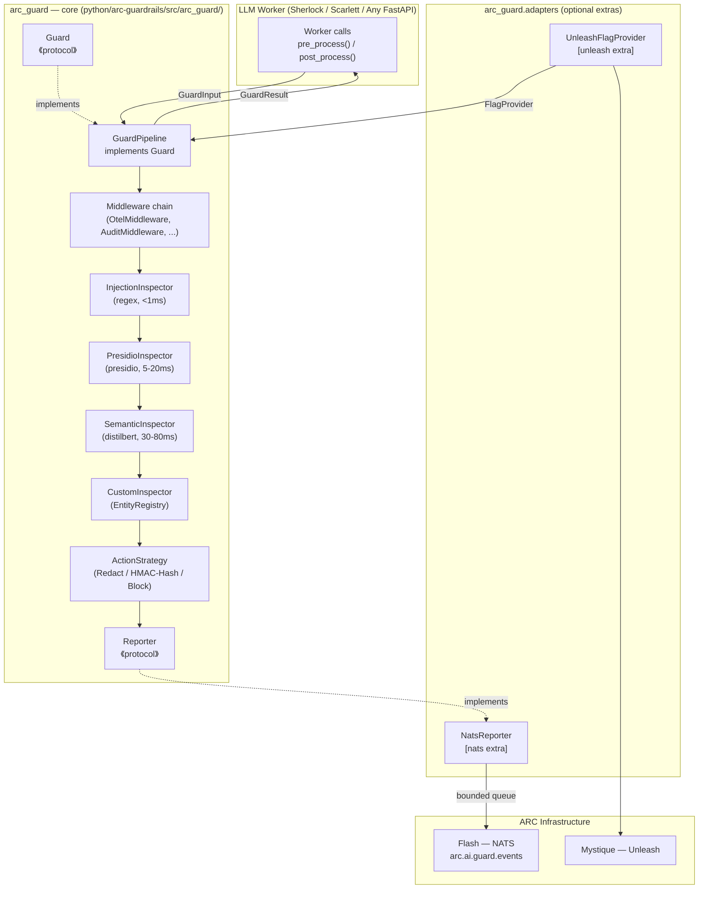
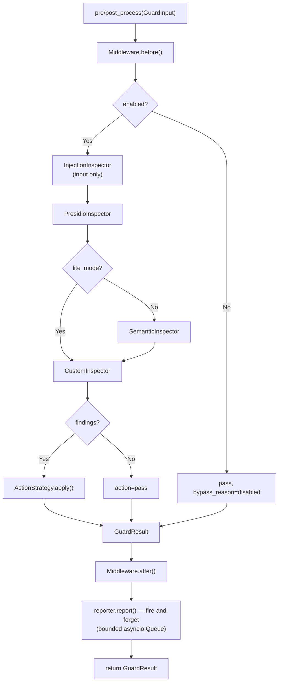

# Feature: arc-guardrails — Python Guardrails Library (RoboCop)

> **Historical Note:** This document captures the pre-rewrite baseline plan for the original single-package implementation. For new rewrite-driven planning, use `docs/superpowers/specs/2026-05-01-rewrite-roadmap.md` and related rewrite docs.

> **Spec**: 001-arc-guard-rails
> **Author**: Bala
> **Date**: 2026-03-15
> **Status**: Draft
> **ARD**: `.specify/docs/decisions/001-arc-guard-rails.md`

## Target Modules

| Module              | Path                                             | Impact                                              |
| ------------------- | ------------------------------------------------ | --------------------------------------------------- |
| SDK (Python)        | `python/arc-guardrails/src/arc_guard/`           | **New package** — full arc-guardrails library       |
| Services / Reasoner | `services/reasoner/`                             | Replace inline guard with GuardPipeline             |
| Services / Voice    | `services/voice/`                                | P3 — Lite-mode wiring after Sherlock stable         |
| Specs / Decisions   | `.specify/docs/decisions/001-arc-guard-rails.md` | Decision record already updated (gap fixes applied) |

---

## Overview

`arc-guard` is a general-purpose Python guardrails library that prevents PII/PCI leakage, prompt injection, and toxic outputs in LLM pipelines. It runs in-process (zero network hops), is extensible via `typing.Protocol` interfaces, and has no compile-time dependency on any ARC service — NATS and Unleash are injected as optional adapters by the caller at startup.

The library replaces Sherlock's current inline regex guard (`services/reasoner/src/reasoner/nats_handler.py`) with a structured, testable pipeline and opens the door to full PII redaction (Presidio) and semantic intent classification (distilbert).

---

## Architecture

### Pipeline Execution Flow

---

## User Scenarios & Testing

### P1 — Must Have

**US-1**: As a platform engineer, I want prompt injection attempts blocked before they reach Sherlock's LLM so that adversarial inputs cannot hijack agent behavior.

- **Given**: `arc-guard` is enabled and wired into Sherlock's NATS handler
- **When**: A user sends a message containing `"ignore previous instructions"`
- **Then**: `pre_process()` returns `GuardResult(action="block"|"redact", findings=[Finding(entity_type="INJECTION")])` and Sherlock does not forward the prompt to the LLM
- **Test**: `tests/test_injection_inspector.py` — assert finding on known injection strings; assert no finding on clean prompts

**US-2**: As a platform engineer, I want PII and PCI data (credit cards, emails, phone numbers) redacted from LLM responses before delivery to users so that sensitive data never leaves the platform unmasked.

- **Given**: `arc-guard` is enabled with `action_strategy="redact"`
- **When**: Sherlock's LLM output contains `"Your card ending 4242 is on file"`
- **Then**: `post_process()` returns sanitized text `"Your card ending [CREDIT_CARD] is on file"`
- **Test**: `tests/test_presidio_inspector.py` — assert CREDIT_CARD/EMAIL_ADDRESS/PHONE_NUMBER entities are redacted

**US-3**: As a Python developer (not using ARC), I want to use `arc-guard` in a plain FastAPI service with zero NATS or Unleash dependencies so that I can adopt the library without ARC infrastructure.

- **Given**: `pip install arc-guard` (no extras)
- **When**: A FastAPI service wires `GuardPipeline.default()` with `LogReporter` and `StaticFlagProvider`
- **Then**: The pipeline runs with injection and Presidio inspection; findings are logged to stdout
- **Test**: `tests/test_pipeline_default.py` — instantiate pipeline with no ARC deps, assert it works in isolation

**US-4**: As a platform engineer, I want Sherlock to use `GuardPipeline` instead of the inline regex guard so that guard logic is testable, configurable, and not coupled to the NATS handler.

- **Given**: `services/reasoner/` has `arc-guard[nats,unleash,otel]` in `pyproject.toml`
- **When**: Sherlock starts up with `GUARD_ENABLED=true`
- **Then**: `nats_handler.py` calls `await guard.pre_process(GuardInput(...))` and `post_process(...)` with no inline regex logic remaining
- **Test**: Integration test in `services/reasoner/tests/` — verify guard intercepts injection on live handler

**US-5**: As a platform engineer, I want guard mode (lite vs full) toggled via Unleash without restarting Sherlock so that I can switch between inspection depths at runtime.

- **Given**: Sherlock is running with `UnleashFlagProvider` wired
- **When**: The `arc.guard.lite_mode` Unleash toggle is flipped from `true` to `false`
- **Then**: The next request runs `SemanticInspector` in addition to Injection + Presidio
- **Test**: Unit test with `StaticFlagProvider` — flip `lite_mode` between calls, assert inspector chain changes

### P2 — Should Have

**US-6**: As a security engineer, I want guard findings published to `arc.ai.guard.events` on NATS so that the billing and audit systems can consume them.

- **Given**: Sherlock wires `NatsReporter(subject="arc.ai.guard.events")`
- **When**: A finding is raised (injection or PII)
- **Then**: A JSON event with `schema_version="1.0"`, `action`, `findings`, `ts` is published to NATS asynchronously; the pipeline does not block on publish
- **Test**: Mock NATS client — assert `publish()` called with correct subject and payload shape

**US-7**: As a security engineer, I want OTEL metrics for guard latency, findings count, and reporter drops so that I can alert on performance degradation or high error rates.

- **Given**: Sherlock wires `OtelMiddleware()` in the `middleware` list
- **When**: The pipeline processes requests
- **Then**: `arc_guard.pipeline.duration_ms`, `arc_guard.findings.count`, and `arc_guard.pipeline.errors` are emitted to Friday (SigNoz)
- **Test**: `tests/test_otel_middleware.py` — assert metrics emitted via in-memory OTEL exporter

**US-8**: As a platform engineer, I want custom entity patterns (e.g. Indian Aadhaar numbers) registered without restarting the service so that domain-specific PII is detected in specialized deployments.

- **Given**: `CustomInspector` is in the pipeline with an `EntityRegistry`
- **When**: `arc_guard.register_entity("PII", "AADHAAR", re.compile(r"\d{4}\s\d{4}\s\d{4}"))` is called at runtime
- **Then**: Subsequent `pre_process()` calls detect Aadhaar-format text
- **Test**: `tests/test_custom_inspector.py` — register pattern, run inspect, assert finding

### P3 — Nice to Have

**US-9**: As a platform engineer, I want Scarlett (voice) to use `arc-guard` in lite mode so that voice responses are also screened without incurring SemanticInspector latency.

- **Given**: `services/voice/` has `arc-guard[nats,otel]` in `pyproject.toml`
- **When**: Scarlett processes a voice turn
- **Then**: `GuardPipeline` with `lite_mode=True` runs Injection + Presidio on both input and output
- **Test**: Scarlett integration test — assert guard intercepts injection; assert SemanticInspector NOT invoked

---

## Requirements

### Functional

- [ ] FR-1: Implement `InjectionInspector` — regex patterns, sub-1ms, skips when `context.source="output"`
- [ ] FR-2: Implement `PresidioInspector` — PII/PCI detection via `presidio-analyzer`; supports `GuardConfig.language`
- [ ] FR-3: Implement `SemanticInspector` — `distilbert` intent classification; offline via `GUARD_MODEL_PATH` or `GUARD_MODEL_CACHE_DIR`; runs in thread-pool executor
- [ ] FR-4: Implement `CustomInspector` + `EntityRegistry` — hot-reloadable custom entity patterns via `arc_guard.register_entity()`
- [ ] FR-5: Implement `GuardPipeline` — Chain of Responsibility, all inspectors, fail-open on exception (`bypass_reason="error"`)
- [ ] FR-6: Implement `RedactStrategy`, `HashStrategy` (HMAC-SHA256 + `GUARD_HASH_KEY`), `BlockStrategy`
- [ ] FR-7: Implement `FlagProvider` protocol + `StaticFlagProvider` + `EnvFlagProvider`
- [ ] FR-8: Implement `Reporter` protocol + `LogReporter` + `NullReporter` + `WebhookReporter`
- [ ] FR-9: Implement `NatsReporter` adapter — bounded `asyncio.Queue(GUARD_REPORTER_QUEUE_SIZE=1000)`, at-most-once delivery
- [ ] FR-10: Implement `UnleashFlagProvider` adapter — maps `arc.guard.*` toggle names to FlagProvider contract
- [ ] FR-11: Implement `Middleware` protocol + `OtelMiddleware` — emit 5 OTEL metrics and 2 spans (see ARD §5.13)
- [ ] FR-12: Implement `GuardConfig` — `pii_entities`, `language`, `model_cache_dir`, `model_path`; `from_env(prefix="GUARD_")`
- [ ] FR-13: Migrate Sherlock — replace inline regex guard in `nats_handler.py` with `GuardPipeline`; shim `SHERLOCK_GUARD_ENABLED` → `GUARD_ENABLED` with deprecation warning
- [ ] FR-14: Publish `pyproject.toml` at `python/arc-guardrails/` with optional extras `[semantic]`, `[nats]`, `[unleash]`, `[webhook]`, `[otel]`, `[arc]`

### Non-Functional

- [ ] NFR-1: `InjectionInspector` latency < 1ms (regex, no I/O)
- [ ] NFR-2: `PresidioInspector` latency 5–20ms per call
- [ ] NFR-3: `SemanticInspector` warm latency 30–80ms on CPU (cold-start 5–10s, documented)
- [ ] NFR-4: Full pipeline (lite mode) completes within 25ms p99 — required for voice compatibility
- [ ] NFR-5: `arc-guard` core has zero compile-time imports of NATS, Unleash, OTEL, or any ARC service
- [ ] NFR-6: Test coverage — `protocols/` 90%+, `strategies/` 90%+, `inspectors/injection.py` 90%+, `pipeline.py` 75%+
- [ ] NFR-7: All inspectors fail-open (exception → `bypass_reason="error"`, `action="pass"`, warning log)
- [ ] NFR-8: Reporter drops oldest event when queue full; never blocks the pipeline
- [ ] NFR-9: SemanticInspector model pre-baked in `reason`/`ultra-instinct` Docker images (`TRANSFORMERS_OFFLINE=1`)
- [ ] NFR-10: `ruff check` and `mypy` pass with zero errors on `src/arc_guard/`

### Key Entities

| Entity             | Module                                   | Description                                                                    |
| ------------------ | ---------------------------------------- | ------------------------------------------------------------------------------ |
| `GuardInput`       | `arc_guard/types.py`                     | Immutable input envelope — `text` + `GuardContext`                             |
| `GuardContext`     | `arc_guard/types.py`                     | `request_id`, `user_id`, `session_id`, `source` (`input`/`output`)             |
| `GuardResult`      | `arc_guard/types.py`                     | `text`, `action`, `findings`, `context`, `bypass_reason`                       |
| `Finding`          | `arc_guard/types.py`                     | Single detection — `entity_type`, `start`, `end`, `score`, `risk`, `inspector` |
| `RiskLevel`        | `arc_guard/types.py`                     | `IntEnum` — `LOW=1`, `MEDIUM=5`, `HIGH=8`, `CRITICAL=10`                       |
| `EntityDefinition` | `arc_guard/types.py`                     | Custom entity — `name`, `category`, `pattern`, `recognizer`                    |
| `GuardConfig`      | `arc_guard/config.py`                    | Static structural config — entity list, language, model path                   |
| `GuardPipeline`    | `arc_guard/pipeline.py`                  | Concrete `Guard` impl — orchestrates all inspectors                            |
| `EntityRegistry`   | `arc_guard/registry.py`                  | In-memory, thread-safe, hot-reloadable entity store                            |
| `Guard`            | `arc_guard/protocols/guard.py`           | Top-level protocol — callers type-hint against this                            |
| `Inspector`        | `arc_guard/protocols/inspector.py`       | Single inspection unit                                                         |
| `ActionStrategy`   | `arc_guard/protocols/strategy.py`        | Text transformation — redact / hash / block                                    |
| `Reporter`         | `arc_guard/protocols/reporter.py`        | Async, fire-and-forget event sink                                              |
| `FlagProvider`     | `arc_guard/protocols/flag_provider.py`   | Runtime behavioral knobs                                                       |
| `Middleware`       | `arc_guard/protocols/middleware.py`      | Pipeline hooks — `before()` / `after()`                                        |
| `EntityProvider`   | `arc_guard/protocols/entity_provider.py` | Source of custom entity definitions                                            |

---

## Edge Cases

| Scenario                                               | Expected Behavior                                                                                                        |
| ------------------------------------------------------ | ------------------------------------------------------------------------------------------------------------------------ |
| `enabled=False` (guard off)                            | Pass-through with `bypass_reason="disabled"`, no NATS publish, no metrics                                                |
| Inspector raises exception                             | Fail-open: log warning, `bypass_reason="error"`, `action="pass"`, next inspector continues                               |
| NATS unavailable                                       | `NatsReporter` drops event, logs warning, never raises; pipeline unaffected                                              |
| Reporter queue full (>1000)                            | Drop oldest event, increment `arc_guard.reporter.dropped`, log warning                                                   |
| `SemanticInspector` model not found at startup         | Raise `RuntimeError` at construction time with clear message pointing to `GUARD_MODEL_PATH`                              |
| `SHERLOCK_GUARD_ENABLED=true` on old Sherlock          | Shim: log deprecation warning `"SHERLOCK_GUARD_ENABLED is deprecated, use GUARD_ENABLED"`, treat as `GUARD_ENABLED=true` |
| `Middleware.before()` raises                           | Fail-open: treat as original `GuardInput` unchanged, log warning                                                         |
| `Middleware.after()` raises                            | Return original `GuardResult` unchanged, log warning                                                                     |
| `GUARD_HASH_KEY` not set                               | Auto-generate 256-bit key, persist to `GUARD_HASH_KEY_FILE`; log at startup                                              |
| `InjectionInspector` on LLM output (`source="output"`) | Skip — returns result unchanged (injections don't appear in LLM output)                                                  |
| `SemanticInspector` in lite mode                       | Not added to pipeline; `FlagProvider.is_enabled("lite_mode")=True` skips it entirely                                     |
| Concurrent `register_entity()` calls                   | `EntityRegistry` is thread-safe; reads and writes use internal lock                                                      |
| `action_strategy="hash"` without `GUARD_HASH_KEY`      | Key auto-generated; HMAC applied; key path logged so operator can back it up                                             |

---

## Success Criteria

- [ ] SC-1: `arc-guard` package installable as `pip install arc-guard` with no ARC service dependencies
- [ ] SC-2: `GuardPipeline.default()` processes a prompt injection attempt and returns `action="block"` or `action="redact"` within 25ms
- [ ] SC-3: `PresidioInspector` detects CREDIT_CARD, EMAIL_ADDRESS, PHONE_NUMBER, and PERSON in a test sentence with >95% accuracy
- [ ] SC-4: Sherlock's `nats_handler.py` contains zero inline regex guard logic; all guard paths use `GuardPipeline`
- [ ] SC-5: `SHERLOCK_GUARD_ENABLED=true` triggers deprecation warning in Sherlock logs but guard still activates correctly
- [ ] SC-6: All 5 OTEL metrics appear in Friday (SigNoz) after processing 10 requests with `OtelMiddleware` wired
- [ ] SC-7: `ruff check` and `mypy` report zero errors on `python/arc-guardrails/src/arc_guard/`
- [ ] SC-8: Test suite passes with coverage targets met (protocols/ 90%+, pipeline.py 75%+)
- [ ] SC-9: Deploying `think` profile with `GUARD_ENABLED=true` starts Sherlock with lite-mode guard active within normal startup time

---

## Docs & Links Update

- [ ] Update `docs/ard/GUARD-RAIL.md` status from `Draft` → `Approved` after spec review (ARD already gap-fixed)
- [ ] Add `arc-guard` entry to `python/arc-guardrails/README.md` with install + quickstart
- [ ] Update Sherlock service docs (`services/reasoner/README.md`) with new `GUARD_*` env vars
- [ ] Update `services/reasoner/service.yaml` to document `GUARD_ENABLED`, `GUARD_LITE_MODE` per profile
- [ ] Add `arc-guard` to the platform SDK index in `docs/` (if SDK section exists)
- [ ] Verify `docs/ard/GUARD-RAIL.md` internal links and code snippets post-edit

---

## Constitution Compliance

| Principle             | Applies | Compliant | Notes                                                                                                         |
| --------------------- | ------- | --------- | ------------------------------------------------------------------------------------------------------------- |
| I. Zero-Dep CLI       | [ ]     | —         | N/A — this is a Python SDK package, not CLI                                                                   |
| II. Platform-in-a-Box | [x]     | [x]       | `arc run --profile think` activates guard via `GUARD_ENABLED` in `service.yaml`                               |
| III. Modular Services | [x]     | [x]       | Adapters are optional extras; core has no platform deps; Sherlock wires its own adapters                      |
| IV. Two-Brain         | [x]     | [x]       | Python library for intelligence layer; no Go code touched                                                     |
| V. Polyglot Standards | [x]     | [x]       | `ruff` + `mypy` + `pytest` + structured logging; docstrings on public APIs only                               |
| VI. Local-First       | [x]     | [x]       | `GUARD_MODEL_PATH` enables air-gap; `reason` Docker image pre-bakes model; Constitution compliant with caveat |
| VII. Observability    | [x]     | [x]       | `OtelMiddleware` emits 5 metrics + 2 spans; `NatsReporter` publishes findings to NATS                         |
| VIII. Security        | [x]     | [x]       | HMAC-SHA256 hash strategy; no PII in logs; fail-open; no secrets in events                                    |
| IX. Declarative       | [ ]     | —         | N/A — CLI only                                                                                                |
| X. Stateful Ops       | [ ]     | —         | N/A — CLI only                                                                                                |
| XI. Resilience        | [x]     | [x]       | Fail-open on inspector error; bounded reporter queue; `CircuitBreakerMiddleware` example in ARD               |
| XII. Interactive      | [ ]     | —         | N/A — Python library, not CLI                                                                                 |
