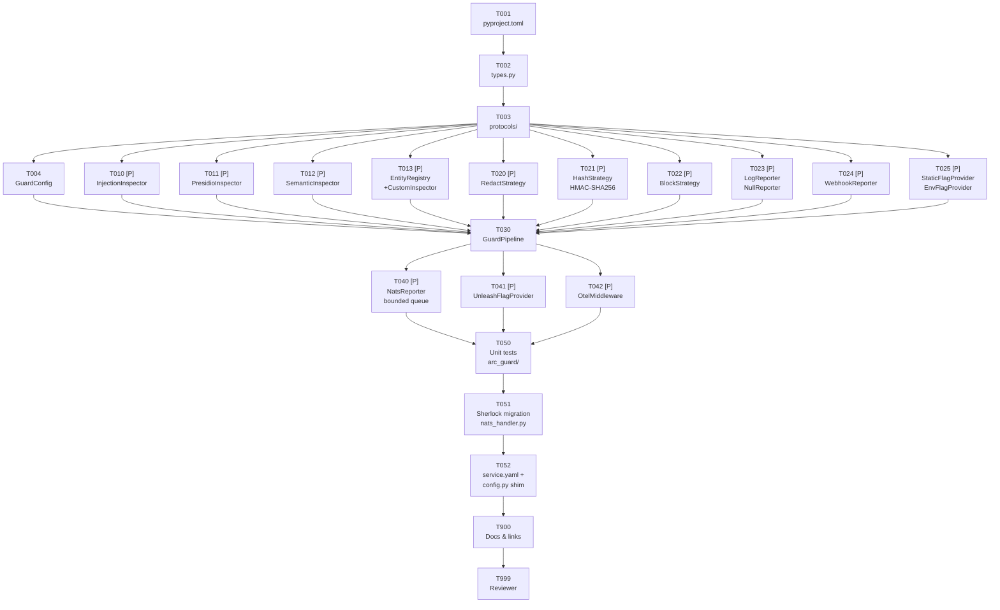

# Tasks: arc-guardrails — Python Guardrails Library (RoboCop)

> **Historical Note:** These tasks belong to the original baseline implementation plan. Use the rewrite roadmap in `docs/superpowers/specs/2026-05-01-rewrite-roadmap.md` to derive future rewrite specs and tasks.

> **Spec**: 001-arc-guard-rails
> **Date**: 2026-03-15

## Task Format

- `[P]` = Safe for parallel agent execution
- Priority: P1 (must), P2 (should), P3 (nice)

---

## Dependency Graph

---

## Quality Requirements

| Module                                                        | Coverage | Lint        |
| ------------------------------------------------------------- | -------- | ----------- |
| `python/arc-guardrails/src/arc_guard/protocols/`              | 90%+     | ruff + mypy |
| `python/arc-guardrails/src/arc_guard/inspectors/injection.py` | 90%+     | ruff + mypy |
| `python/arc-guardrails/src/arc_guard/strategies/`             | 90%+     | ruff + mypy |
| `python/arc-guardrails/src/arc_guard/pipeline.py`             | 75%+     | ruff + mypy |
| `python/arc-guardrails/src/arc_guard/reporters/`              | 70%+     | ruff + mypy |
| `python/arc-guardrails/src/arc_guard/adapters/`               | 60%+     | ruff + mypy |

---

## Phase 1: Setup

- [x] **[TASK-001]** [SDK] [P1] Scaffold `arc-guard` package — create `pyproject.toml`, directory tree, `__init__.py`
  - Dependencies: none
  - Module: `python/arc-guardrails/`
  - Acceptance: `pip install -e python/arc-guardrails` succeeds with zero extras; `from arc_guard import GuardPipeline` imports without error; `pyproject.toml` defines all optional extras (`[semantic]`, `[nats]`, `[unleash]`, `[webhook]`, `[otel]`, `[arc]`)

---

## Phase 2: Foundational

- [x] **[TASK-002]** [SDK] [P1] Implement `types.py` — all core data types
  - Dependencies: TASK-001
  - Module: `python/arc-guardrails/src/arc_guard/types.py`
  - Acceptance: `GuardInput`, `GuardContext`, `GuardResult` (with `bypass_reason`), `Finding`, `RiskLevel`, `EntityDefinition` are importable; `GuardResult.is_clean` and `GuardResult.max_risk` properties work; all are frozen dataclasses or IntEnum where appropriate

- [x] **[TASK-003]** [SDK] [P1] Implement `protocols/` — all 7 `typing.Protocol` interfaces
  - Dependencies: TASK-002
  - Module: `python/arc-guardrails/src/arc_guard/protocols/`
  - Acceptance: `Guard`, `Inspector`, `ActionStrategy`, `Reporter`, `FlagProvider`, `EntityProvider`, `Middleware` all decorated `@runtime_checkable`; `protocols/__init__.py` re-exports all 7; `isinstance(LogReporter(), Reporter)` returns `True` at runtime

- [x] **[TASK-004]** [SDK] [P1] Implement `GuardConfig` — static structural config with `from_env()`
  - Dependencies: TASK-003
  - Module: `python/arc-guardrails/src/arc_guard/config.py`
  - Acceptance: `GuardConfig()` instantiates with defaults; `GuardConfig.from_env(prefix="GUARD_")` reads `GUARD_PII_ENTITIES`, `GUARD_LANGUAGE`, `GUARD_MODEL_PATH`, `GUARD_MODEL_CACHE_DIR`; `mypy` passes; no behavioral flags (`enabled`, `lite_mode`) in this model

---

## Phase 3: Implementation

### Parallel Batch A — Inspectors

- [x] **[TASK-010]** [P] [SDK] [P1] Implement `InjectionInspector` — regex-based, skips on `source="output"`
  - Dependencies: TASK-003
  - Module: `python/arc-guardrails/src/arc_guard/inspectors/injection.py`
  - Acceptance: Detects `"ignore previous instructions"`, `"jailbreak"`, `"DAN mode"`, `<|system|>` patterns; returns unchanged `GuardResult` when `context.source == "output"`; latency < 1ms on 1KB input; never raises — catches all exceptions internally

- [x] **[TASK-011]** [P] [SDK] [P1] Implement `PresidioInspector` — PII/PCI detection
  - Dependencies: TASK-003
  - Module: `python/arc-guardrails/src/arc_guard/inspectors/presidio.py`
  - Acceptance: Detects CREDIT_CARD, EMAIL_ADDRESS, PHONE_NUMBER, PERSON in test sentence; `context.source` included in `Finding` metadata; custom recognizers from `EntityRegistry` injected at init; `AnalyzerEngine` mockable in unit tests; latency 5-20ms on warm engine

- [x] **[TASK-012]** [P] [SDK] [P1] Implement `SemanticInspector` — distilbert intent classifier
  - Dependencies: TASK-003
  - Module: `python/arc-guardrails/src/arc_guard/inspectors/semantic.py`
  - Acceptance: Model loaded from `GuardConfig.model_path` if set (no network call); falls back to `GuardConfig.model_cache_dir`; runs via `run_in_executor` (never blocks event loop); per-source thresholds via `FlagProvider.get_string("semantic_input_threshold")`; skipped by `GuardPipeline` when `lite_mode=True`; unit tests skipped unless `GUARD_RUN_SEMANTIC_TESTS=1`

- [x] **[TASK-013]** [P] [SDK] [P2] Implement `EntityRegistry` + `CustomInspector` — hot-reloadable patterns
  - Dependencies: TASK-003
  - Module: `python/arc-guardrails/src/arc_guard/registry.py`, `python/arc-guardrails/src/arc_guard/inspectors/custom.py`
  - Acceptance: `arc_guard.register_entity("PII", "AADHAAR", re.compile(...))` registers pattern; `CustomInspector.inspect()` reads from registry on every call (no caching — hot-reloadable); thread-safe reads and writes; `EntityProvider` protocol satisfied structurally

### Parallel Batch B — Strategies, Reporters, Flag Providers

- [x] **[TASK-020]** [P] [SDK] [P1] Implement `RedactStrategy` — replace span with `[ENTITY_TYPE]`
  - Dependencies: TASK-003
  - Module: `python/arc-guardrails/src/arc_guard/strategies/redact.py`
  - Acceptance: `apply(text, findings)` replaces each span with `[ENTITY_TYPE]`; handles overlapping spans correctly (sort by start desc); returns `(sanitized_text, "redact")`

- [x] **[TASK-021]** [P] [SDK] [P1] Implement `HashStrategy` — HMAC-SHA256 with `GUARD_HASH_KEY`
  - Dependencies: TASK-003
  - Module: `python/arc-guardrails/src/arc_guard/strategies/hash.py`
  - Acceptance: Uses `hmac.new(key, span.encode(), hashlib.sha256).hexdigest()[:16]`; key loaded from `GUARD_HASH_KEY` env or auto-generated with `secrets.token_bytes(32)` and persisted to `GUARD_HASH_KEY_FILE`; key never logged; returns `(hashed_text, "hash")`

- [x] **[TASK-022]** [P] [SDK] [P1] Implement `BlockStrategy` — return empty string + block action
  - Dependencies: TASK-003
  - Module: `python/arc-guardrails/src/arc_guard/strategies/block.py`
  - Acceptance: `apply(text, findings)` returns `("", "block")` regardless of findings; strategy satisfies `ActionStrategy` protocol structurally

- [x] **[TASK-023]** [P] [SDK] [P1] Implement `LogReporter` + `NullReporter`
  - Dependencies: TASK-003
  - Module: `python/arc-guardrails/src/arc_guard/reporters/log_reporter.py`, `null_reporter.py`
  - Acceptance: `LogReporter.report()` calls `logger.warning(...)` only when `not result.is_clean`; `NullReporter.report()` is a no-op; both satisfy `Reporter` protocol; neither raises under any condition

- [x] **[TASK-024]** [P] [SDK] [P2] Implement `WebhookReporter` — HTTP POST via httpx
  - Dependencies: TASK-003
  - Module: `python/arc-guardrails/src/arc_guard/reporters/webhook_reporter.py`
  - Acceptance: Requires `arc-guard[webhook]` extra; `ImportError` raised at construction if `httpx` not installed; `report()` POSTs serialized `GuardResult` JSON to configured URL; timeout configurable; never raises — catches all exceptions internally

- [x] **[TASK-025]** [P] [SDK] [P1] Implement `StaticFlagProvider` + `EnvFlagProvider`
  - Dependencies: TASK-003
  - Module: `python/arc-guardrails/src/arc_guard/flags/static_provider.py`, `env_provider.py`
  - Acceptance: `StaticFlagProvider({"enabled": True, "lite_mode": False})` returns correct values for `is_enabled`, `get_string`, `get_list`; `EnvFlagProvider(prefix="GUARD_")` reads `GUARD_ENABLED`, `GUARD_LITE_MODE`, `GUARD_ACTION_STRATEGY` from `os.environ`; both satisfy `FlagProvider` protocol

### Sequential — GuardPipeline (requires Batch A + B)

- [x] **[TASK-030]** [SDK] [P1] Implement `GuardPipeline` — Chain-of-Responsibility orchestrator
  - Dependencies: TASK-004, TASK-010, TASK-011, TASK-012, TASK-013, TASK-020, TASK-021, TASK-022, TASK-023, TASK-025
  - Module: `python/arc-guardrails/src/arc_guard/pipeline.py`
  - Acceptance:
    - `GuardPipeline.default()` works with zero extras
    - `pre_process(GuardInput)` runs Middleware.before → inspectors → ActionStrategy → Middleware.after → reporter.report (fire-and-forget) → return `GuardResult`
    - `post_process()` same flow; `InjectionInspector` skipped for output
    - `flags.is_enabled("enabled") == False` → `bypass_reason="disabled"`, skip all inspectors
    - Inspector exception → log warning, `bypass_reason="error"`, pass unchanged result to next inspector
    - `lite_mode=True` → `SemanticInspector` not added to chain
    - Strategy resolved from `flags.get_string("action_strategy")` (default: `"redact"`)
    - Middleware `before()` exception → log warning, use original `GuardInput`
    - Middleware `after()` exception → log warning, return pre-`after` `GuardResult`

---

## Phase 4: Integration

### Parallel Batch C — Adapters + Middleware

- [x] **[TASK-040]** [P] [SDK] [P1] Implement `NatsReporter` adapter — bounded queue
  - Dependencies: TASK-030
  - Module: `python/arc-guardrails/src/arc_guard/adapters/nats_reporter.py`
  - Acceptance: Requires `arc-guard[nats]` extra; `asyncio.Queue(maxsize=GUARD_REPORTER_QUEUE_SIZE)` (default 1000); queue-full → drop oldest + log warning; background `_drain_loop` task started on first `report()` call; events serialized to JSON matching schema v1.0 (with `schema_version`, `phase`, `bypass_reason`); NATS publish failure → log warning, never raises; default subject: `arc.ai.guard.events`

- [x] **[TASK-041]** [P] [SDK] [P2] Implement `UnleashFlagProvider` adapter
  - Dependencies: TASK-030
  - Module: `python/arc-guardrails/src/arc_guard/adapters/unleash_provider.py`
  - Acceptance: Requires `arc-guard[unleash]` extra; maps `FlagProvider` calls to `UnleashClient.is_enabled(f"arc.guard.{flag}")` and `get_variant(...)`; caller provides already-initialised `UnleashClient`; satisfies `FlagProvider` structurally

- [x] **[TASK-042]** [P] [SDK] [P2] Implement `OtelMiddleware` — 5 metrics + 2 spans
  - Dependencies: TASK-030
  - Module: `python/arc-guardrails/src/arc_guard/middleware/otel.py`
  - Acceptance: Requires `arc-guard[otel]` extra; emits `arc_guard.pipeline.duration_ms` (histogram), `arc_guard.inspector.duration_ms` (histogram, per inspector label), `arc_guard.findings.count` (counter), `arc_guard.pipeline.errors` (counter), `arc_guard.reporter.dropped` (counter); creates span `arc_guard.pre_process` / `arc_guard.post_process` with `guard.action` + `guard.findings_count` attributes; no-op if OTEL SDK not configured

### Unit Test Suite

- [x] **[TASK-050]** [SDK] [P1] Write unit test suite for `arc_guard/`
  - Dependencies: TASK-040, TASK-041, TASK-042
  - Module: `python/arc-guardrails/tests/`
  - Acceptance:
    - `test_injection_inspector.py` — known patterns detected; clean prompts pass; `source="output"` skips inspection
    - `test_presidio_inspector.py` — CREDIT_CARD, EMAIL, PHONE, PERSON detected; mock `AnalyzerEngine`
    - `test_strategies.py` — RedactStrategy replaces spans; HashStrategy uses HMAC; BlockStrategy returns `("", "block")`
    - `test_pipeline.py` — fail-open on exception; `bypass_reason="disabled"` when off; lite_mode skips SemanticInspector; middleware short-circuit works
    - `test_flag_providers.py` — StaticFlagProvider and EnvFlagProvider return correct types
    - `test_nats_reporter.py` — queue-full drops oldest; mock NATS client receives correct payload
    - Coverage gates met: `protocols/` ≥90%, `pipeline.py` ≥75%, `injection.py` ≥90%, `strategies/` ≥90%
    - `ruff check python/arc-guardrails/src/arc_guard/` — zero errors
    - `mypy python/arc-guardrails/src/arc_guard/` — zero errors

### Sherlock Migration

- [x] **[TASK-051]** [REASONER] [P1] Migrate Sherlock — replace inline guard with GuardPipeline
  - Dependencies: TASK-050
  - Module: `services/reasoner/`
  - Acceptance:
    - `services/reasoner/pyproject.toml` adds `arc-guard[nats,unleash,otel]` dependency
    - `nats_handler.py` has zero occurrences of `_INJECTION_PATTERNS`, `_UNSAFE_OUTPUT_PATTERNS`, or inline guard logic
    - `nats_handler.py` calls `await guard.pre_process(GuardInput(text=prompt, context=ctx))` and `await guard.post_process(GuardInput(text=response, context=ctx))`
    - `GuardPipeline` injected at Sherlock startup (not constructed inside handler)
    - Old NATS subjects (`arc.reasoner.guard.rejected`, `arc.reasoner.guard.intercepted`) remain as deprecated aliases in `NatsReporter` for this release

- [x] **[TASK-052]** [REASONER] [P1] Add `SHERLOCK_GUARD_ENABLED` shim + update `service.yaml`
  - Dependencies: TASK-051
  - Module: `services/reasoner/src/reasoner/config.py`, `services/reasoner/service.yaml`
  - Acceptance:
    - `config.py` shim: if `SHERLOCK_GUARD_ENABLED=true` in env, log `DeprecationWarning` and activate guard
    - `service.yaml` documents `GUARD_ENABLED`, `GUARD_LITE_MODE`, `GUARD_MODEL_PATH` env vars with per-profile values (think=lite, reason/ultra-instinct=full)
    - `services/reasoner/tests/` existing tests still pass with no guard regressions
    - `GUARD_ENABLED=false` (default) → guard disabled, Sherlock behaves identically to pre-migration

---

## Phase 5: Polish

- [x] **[TASK-900]** [P] [DOCS] [P1] Docs & links update
  - Dependencies: TASK-052
  - Module: `.specify/docs/decisions/001-arc-guard-rails.md`, `services/reasoner/README.md`, `python/arc-guardrails/README.md`
  - Acceptance:
    - `.specify/docs/decisions/001-arc-guard-rails.md` status updated from `Draft` → `Approved`
    - `services/reasoner/README.md` documents new `GUARD_*` env vars
    - `python/arc-guardrails/README.md` includes install instructions + minimal quickstart (`GuardPipeline.default()`)
    - No broken internal links in updated docs

- [x] **[TASK-999]** [REVIEW] [P1] Reviewer agent verification — all quality gates
  - Dependencies: ALL
  - Module: all affected modules
  - Acceptance:
    - All tasks above marked `[x]` done
    - `pytest python/arc-guardrails/tests/ -q` — all pass, coverage gates met
    - `pytest services/reasoner/tests/ -q` — all pass (no regressions)
    - `ruff check python/arc-guardrails/src/arc_guard/` — zero errors
    - `mypy python/arc-guardrails/src/arc_guard/` — zero errors
    - `from arc_guard import GuardPipeline` works with only core extras installed
    - `from arc_guard.adapters.nats_reporter import NatsReporter` requires `arc-guard[nats]`
    - `nats_handler.py` contains zero occurrences of `_INJECTION_PATTERNS` or `_UNSAFE_OUTPUT_PATTERNS`
    - `GuardResult.bypass_reason` is set correctly in all pipeline paths
    - `HashStrategy` uses `hmac`, not `hashlib.sha256` directly
    - `GUARD_ENABLED=false` (default) → all Sherlock tests pass unmodified
    - `.specify/docs/decisions/001-arc-guard-rails.md` status = `Approved`

---

## Progress Summary

| Phase          | Total  | Done  | Parallel |
| -------------- | ------ | ----- | -------- |
| Setup          | 1      | 0     | 0        |
| Foundational   | 3      | 0     | 0        |
| Implementation | 12     | 0     | 11       |
| Integration    | 5      | 0     | 3        |
| Polish         | 2      | 0     | 1        |
| **Total**      | **23** | **0** | **15**   |
