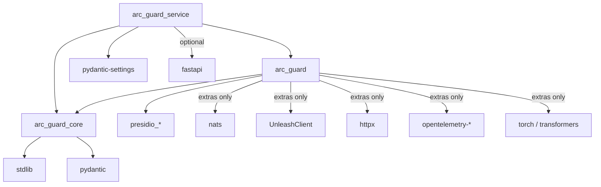

# Contract — Package Boundaries

This contract is the on-disk version of FR-001 through FR-006. The enforcement happens through `import-linter` rules executed by `tools/check_import_graph.py`.

## Allowed import edges



Reading the rules:

| From | May import | May NOT import |
|---|---|---|
| `arc_guard_core` | stdlib, `pydantic` | `arc_guard`, `arc_guard_service`, any provider SDK, any adapter |
| `arc_guard` | `arc_guard_core`, `presidio_*`, optional extras when their extra is enabled | `arc_guard_service` |
| `arc_guard_service` | `arc_guard`, `arc_guard_core`, `pydantic-settings`, optional FastAPI | _(no restrictions beyond above)_ |

## `import-linter` rules

```ini
[importlinter]
root_packages =
    arc_guard_core
    arc_guard
    arc_guard_service

[importlinter:contract:layered]
name = api → pip → core, never reversed
type = layers
layers =
    arc_guard_service
    arc_guard
    arc_guard_core

[importlinter:contract:core_zero_dep]
name = core has no provider runtime dependencies
type = forbidden
source_modules = arc_guard_core
forbidden_modules =
    presidio_analyzer
    presidio_anonymizer
    nats
    UnleashClient
    httpx
    opentelemetry
    torch
    transformers
ignore_imports =
    arc_guard_core.types -> typing  # no-op, here for example shape

[importlinter:contract:pip_no_api]
name = pip never depends on api
type = forbidden
source_modules = arc_guard
forbidden_modules = arc_guard_service

[importlinter:contract:adapter_isolation]
name = core never imports any module under arc_guard.adapters
type = forbidden
source_modules = arc_guard_core
forbidden_modules = arc_guard.adapters
```

These rules MUST stay in sync with this document. The contract test asserts the rules file matches the rules table above.

## TYPE_CHECKING exception

`core` MAY use `if TYPE_CHECKING:` to import provider symbols *for type annotations only*. The import-graph linter ignores `TYPE_CHECKING` blocks by default. Where a runtime annotation is unavoidable (e.g. the `recognizer` field on `EntityDefinition`), the field is typed as `Any` rather than the real type — see [`../data-model.md` §8](../data-model.md).

## Enforcement on every commit

`tools/check_import_graph.py`:

1. Runs `lint-imports --config packages/.importlinter`.
2. Runs `python -c "import arc_guard_core; print(sys.modules)"` and asserts the loaded module list contains zero forbidden names. (Belt-and-suspenders: catches lazy imports the linter cannot see statically.)
3. Runs `uv tree --package arc-guard-core` and asserts the dependency closure contains only `pydantic` and stdlib.

## Dependency-tree audit (SC-002)

Separate from `tools/check_import_graph.py`, `tools/check_dependency_tree.py` runs `uv tree` and parses the result, asserting:

- `arc-guard-core` has zero runtime entries beyond `pydantic` and Python stdlib.
- `arc-guard` has at most: `arc-guard-core`, `presidio-analyzer`, `presidio-anonymizer`, plus optional extras.
- `arc-guard-service` has at most: `arc-guard`, `pydantic-settings`, and the api-framework extra.

## Async-blocking enforcement (FR-025)

`tools/check_async_blocking.py` walks the AST of every `arc_guard*` module and flags:

- Calls to `time.sleep`, `subprocess.run`, `subprocess.check_output`, `socket.recv`, `socket.send`, blocking `requests` / `urllib` calls inside any function reachable from `Guard.pre_process` / `Guard.post_process`.
- Calls to known-blocking model-inference entry points (`presidio_analyzer.AnalyzerEngine.analyze`, `transformers.pipeline.__call__`) inside async functions.

These are flagged unless wrapped in `loop.run_in_executor` or `asyncio.to_thread`.

## Adding a new package

If a fourth package becomes necessary in Spec 003+:

1. Update the `[importlinter]` `root_packages` list.
2. Add a layer rule placing it correctly in the dependency direction.
3. Update this file.
4. CHANGELOG entry on every affected package.

## Removing a package

Same flow as removing a public type — see [`deprecation-policy.md`](./deprecation-policy.md).
