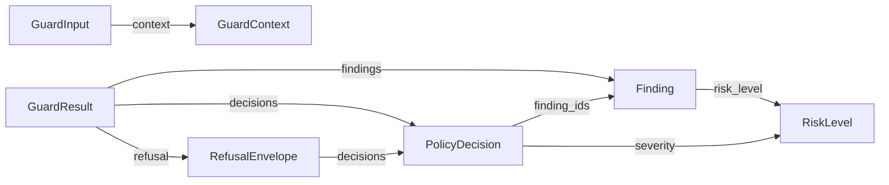

# Phase 1 — Data Model: Rewrite Foundation

**Feature**: 002-rewrite-foundation
**Date**: 2026-05-01
**Scope**: Every public typed model defined or stabilized by Spec 002. Field-level descriptions, validation rules, stability markers, and the relationships between them.

This file is the single source of truth for the contract types until Spec 003+ extends them additively. The contract test suite under `packages/core/tests/contract/` snapshots these types and fails on any incompatible change.

---

## Conventions

- **Stability markers**: every public type carries one of `@stable`, `@experimental`, `@deprecated`. Spec 002 ships everything as `@stable` except the OTEL hook protocols (`@experimental` until Spec 004).
- **Versioning**: every public type's snapshot row carries the package version that introduced its current shape. Additive changes bump the package minor; renames or removals bump the major and require a deprecation entry.
- **Implementation kind**: `dataclass` (frozen, internal value type) or `pydantic` (boundary model with validation). The choice follows research.md §4.
- **Home package**: every type lives in `packages/core/` unless otherwise marked.

---

## 1. `RiskLevel`

**Kind**: `IntEnum`
**Home**: `arc_guard_core.types`
**Stability**: `@stable`

```python
class RiskLevel(IntEnum):
    NONE = 0
    LOW = 1
    MEDIUM = 2
    HIGH = 3
    CRITICAL = 4
```

**Validation rules**: integer-ordered. Any `Finding` with a `risk_level` outside this enum fails contract validation at the pipeline boundary (FR-018).

**Migration from Spec 001**: identical shape; no change.

---

## 2. `GuardContext`

**Kind**: frozen dataclass
**Home**: `arc_guard_core.types`
**Stability**: `@stable`

| Field | Type | Default | Description |
|---|---|---|---|
| `source` | `Literal["input", "output"]` | `"input"` | Which side of the LLM call the guard runs on. Some inspectors only run on `"input"`. |
| `user_id` | `str \| None` | `None` | Optional caller identity for per-user audit. Never logged in `core` defaults. |
| `session_id` | `str \| None` | `None` | Optional conversation identifier. |
| `correlation_id` | `str \| None` | `None` | **NEW in Spec 002.** Trace-correlation identifier. Hooked into the `Tracer` protocol when provided. |
| `metadata` | `dict[str, Any]` | `{}` | Arbitrary key-value extension point. Adapter-specific. |

**Validation rules**:
- `source` MUST be one of the two literals (Pydantic / Literal-typed, dataclass-checked at boundary).
- `correlation_id`, when present, MUST be non-empty.
- `metadata` keys MUST be strings. Values are not type-checked by the contract layer (adapters are responsible for their own keys).

**Migration from Spec 001**: adds `correlation_id`. Additive; existing callers are unaffected.

---

## 3. `GuardInput`

**Kind**: frozen dataclass
**Home**: `arc_guard_core.types`
**Stability**: `@stable`

| Field | Type | Default | Description |
|---|---|---|---|
| `text` | `str` | required | The text to inspect / transform. |
| `context` | `GuardContext` | `GuardContext()` | Contextual metadata. |
| `policy_hints` | `frozenset[str]` | `frozenset()` | **NEW in Spec 002.** Caller-supplied hints (e.g. `"strict"`, `"lite"`) consumed by the policy router in Spec 003. Unrecognized hints are ignored. |

**Validation rules**:
- `text` is permitted to be empty; the pipeline returns a no-op `GuardResult` in that case.
- `policy_hints` is a frozenset to keep the input hashable.

**Migration from Spec 001**: adds `policy_hints`. Additive.

---

## 4. `Finding`

**Kind**: frozen dataclass
**Home**: `arc_guard_core.types`
**Stability**: `@stable`

| Field | Type | Default | Description |
|---|---|---|---|
| `entity_type` | `str` | required | Normalised label (e.g. `"CREDIT_CARD"`, `"INJECTION"`, `"EMPLOYEE_NAME"`). |
| `start` | `int` | required | Character offset, inclusive. `>= 0`. |
| `end` | `int` | required | Character offset, exclusive. `> start`. |
| `risk_level` | `RiskLevel` | required | Severity. |
| `inspector` | `str` | required | Name of the producing inspector. |
| `score` | `float \| None` | `None` | Optional confidence in `[0.0, 1.0]`. |
| `metadata` | `dict[str, Any]` | `{}` | Inspector-specific extras. |

**Validation rules** (enforced at the pipeline contract boundary, FR-018):
- `start >= 0`, `end > start`.
- `score`, when present, in `[0.0, 1.0]`.
- `entity_type` non-empty.
- `inspector` non-empty.

**Helper property** (carried from Spec 001):
- `span -> str`: returns `f"[{start}:{end}]"` for log lines.

**Migration from Spec 001**: identical.

---

## 5. `PolicyDecision`

**Kind**: frozen dataclass
**Home**: `arc_guard_core.types`
**Stability**: `@stable`

| Field | Type | Default | Description |
|---|---|---|---|
| `finding_ids` | `tuple[int, ...]` | required | Indices into the `GuardResult.findings` tuple that this decision applies to. |
| `strategy` | `str` | required | Strategy identifier (`"redact"`, `"hash"`, `"block"`, `"tokenize"`, or registered custom name). |
| `severity` | `RiskLevel` | required | Aggregated severity for the decision. |
| `rationale` | `str` | required | Short, human-readable rationale. Used by `RefusalEnvelope.next_steps` and the explainability log. |
| `metadata` | `dict[str, Any]` | `{}` | Strategy-specific extras (e.g. hash algorithm, token bucket id). |

**Validation rules**:
- `finding_ids` non-empty.
- `strategy` non-empty.
- `rationale` non-empty.

**Migration from Spec 001**: NEW. Spec 001 had no explicit policy-decision type; routing was implicit. This contract is what Spec 003's composable router will populate.

---

## 6. `RefusalEnvelope`

**Kind**: frozen dataclass
**Home**: `arc_guard_core.types`
**Stability**: `@stable`

| Field | Type | Default | Description |
|---|---|---|---|
| `code` | `str` | required | Stable, machine-readable refusal code. Drawn from the `RefusalCode` registry maintained in `arc_guard_core.refusal.codes`. |
| `trigger` | `str` | required | What triggered the refusal (e.g. `"jailbreak"`, `"pii_critical"`, `"fidelity_drop"`). |
| `policy` | `str` | required | The policy identifier that fired. |
| `decisions` | `tuple[PolicyDecision, ...]` | `()` | The decisions that produced this refusal, in order. |
| `human_message` | `str` | required | Human-readable explanation suitable for direct display. |
| `next_steps` | `tuple[str, ...]` | `()` | Optional list of suggested user actions. |
| `metadata` | `dict[str, Any]` | `{}` | Extension point. |

**Validation rules**:
- `code` non-empty and registered in `RefusalCode`.
- `human_message` non-empty.
- `policy` non-empty.

**Migration from Spec 001**: NEW. Spec 001 returned `action="block"` with no envelope. This contract is what Spec 003's graceful-refusal flow will populate.

---

## 7. `GuardResult`

**Kind**: frozen dataclass
**Home**: `arc_guard_core.types`
**Stability**: `@stable`

| Field | Type | Default | Description |
|---|---|---|---|
| `text` | `str` | required | Possibly transformed text. Empty when `action == "block"`. |
| `action` | `Literal["pass", "redact", "hash", "block", "tokenize"]` | `"pass"` | Aggregate action. `"tokenize"` is **NEW in Spec 002** to support Spec 003's policy router. |
| `findings` | `tuple[Finding, ...]` | `()` | All detections from all inspectors. |
| `decisions` | `tuple[PolicyDecision, ...]` | `()` | **NEW in Spec 002.** Per-finding decisions; populated by Spec 003. |
| `refusal` | `RefusalEnvelope \| None` | `None` | **NEW in Spec 002.** Set when `action == "block"` (and may be set on partial-restrict actions in Spec 003). |
| `bypass_reason` | `Literal["disabled", "error", None]` | `None` | Set when the pipeline short-circuited. |
| `phase` | `Literal["pre_process", "post_process"]` | `"pre_process"` | Which side of the LLM call this result belongs to. |

**Helper properties** (carried from Spec 001):
- `is_clean -> bool`
- `max_risk -> RiskLevel`

**Validation rules**:
- If `action == "block"`, `refusal` MUST be set.
- If `bypass_reason == "error"`, `action` MUST be `"pass"` and `findings` MUST be empty (fail-open contract).
- `findings` and `decisions` are tuples (immutable, hashable).

**Migration from Spec 001**: adds `decisions`, `refusal`, `tokenize` literal. All additive.

---

## 8. `EntityDefinition`

**Kind**: frozen dataclass
**Home**: `arc_guard_core.types`
**Stability**: `@stable`

| Field | Type | Default | Description |
|---|---|---|---|
| `name` | `str` | required | Unique label, e.g. `"AADHAAR"`, `"NZ_IRD"`, `"EMPLOYEE_NAME"`. |
| `category` | `str` | required | Broad bucket: `"PII"`, `"PCI"`, `"ENTERPRISE"`, `"CUSTOM"`. |
| `pattern` | `re.Pattern[str] \| None` | `None` | Optional compiled regex. |
| `recognizer` | `Any \| None` | `None` | Optional Presidio `PatternRecognizer`. **Type kept as `Any`** so `core` does not import presidio. |

**Validation rules**:
- `name` and `category` non-empty.
- At least one of `pattern` or `recognizer` SHOULD be set; an `EntityDefinition` with neither is allowed but cannot match anything.

**Migration from Spec 001**: identical, but the `recognizer: Any` annotation is intentional — `core` MUST NOT import `presidio_analyzer.PatternRecognizer` even for typing (FR-006). The implementation typing escape is recorded as a localized exception in `.specify/memory/libraries.md`.

---

## 9. `GuardConfig`

**Kind**: pydantic model (`BaseModel`, `model_config = ConfigDict(frozen=True, extra='forbid')`)
**Home**: `arc_guard_core.config`
**Stability**: `@stable`

The config model defines the *structure* of guard configuration. Environment hydration lives in `packages/pip/src/arc_guard/config_env.py` per research.md §1; `core` itself does no env IO (FR-020).

| Field | Type | Default | Description |
|---|---|---|---|
| `enabled` | `bool` | `True` | Master switch. When `False`, the pipeline returns `bypass_reason="disabled"`. |
| `lite_mode` | `bool` | `False` | Skip expensive inspectors (preserved from Spec 001). |
| `inspector_order` | `tuple[str, ...]` | preset | Ordered list of inspector names. |
| `policy_hints_default` | `frozenset[str]` | `frozenset()` | Hints applied to every input absent caller override. |
| `tracer` | `Tracer` | `NullTracer()` | Observability hook (research.md §9). |
| `logger` | `Logger` | `NullLogger()` | Observability hook. |
| `metrics` | `MetricSink` | `NullMetricSink()` | Observability hook. |

**Validation rules**:
- `extra='forbid'` rejects unknown fields at load time (FR-016).
- Cross-field rule: if `enabled=False`, all other fields are still validated but not consulted.
- `inspector_order` MUST contain only registered inspector names; a missing name fails validation with the offending name in the error message.

**Migration from Spec 001**: adds `policy_hints_default`, `tracer`, `logger`, `metrics`. The Spec 001 `GuardConfig` shape is preserved; new fields default safely.

---

## 10. Observability hook protocols

**Kind**: `typing.Protocol`
**Home**: `arc_guard_core.observability`
**Stability**: `@experimental` until Spec 004 stabilizes them.

```python
class Tracer(Protocol):
    def start_span(self, name: str, *, attributes: Mapping[str, Any] | None = None) -> AbstractContextManager[Any]: ...

class Logger(Protocol):
    def bind(self, **fields: Any) -> "Logger": ...
    def event(self, name: str, *, level: str = "info", **fields: Any) -> None: ...

class MetricSink(Protocol):
    def counter(self, name: str, value: int = 1, *, attributes: Mapping[str, Any] | None = None) -> None: ...
    def histogram(self, name: str, value: float, *, attributes: Mapping[str, Any] | None = None) -> None: ...
```

**Default implementations** (also in `arc_guard_core.observability`): `NullTracer`, `NullLogger`, `NullMetricSink`. All methods are no-ops; `start_span` returns a context manager whose `__enter__` returns `None` and whose `__exit__` swallows nothing.

**Validation rules**: structural (Protocol). Implementations are not constructed by the contract layer; users supply concrete instances through `GuardConfig`.

**Stability handoff**: Spec 004 will lock these signatures and remove the `@experimental` marker once OTEL exporters are wired.

---

## 11. Pipeline-level protocols (carried from Spec 001, frozen here)

**Kind**: `typing.Protocol`
**Home**: `arc_guard_core.protocols`
**Stability**: `@stable`

The seven Spec 001 protocols are migrated as-is, with each protocol's docstring extended to declare:
- whether it is sync or async,
- which exceptions it MAY raise,
- thread-safety expectations,
- whether each declared exception is fail-open or fail-closed.

| Protocol | Sync/Async | Thread-safety | Notes |
|---|---|---|---|
| `Guard` | both (`pre_process`, `post_process` are async; `pre_process_sync`, `post_process_sync` are sync wrappers) | thread-safe | Public entry point. |
| `Inspector` | sync `inspect` returns `GuardResult` | thread-safe (must not hold mutable instance state) | Called inside the pipeline. |
| `ActionStrategy` | sync `apply` | thread-safe | Strategy must not perform IO. |
| `Reporter` | async `report` returns `None` | thread-safe; bounded queue inside | Fire-and-forget; never blocks the pipeline. |
| `FlagProvider` | sync `is_enabled` | thread-safe | May cache; cache must be safe to share. |
| `Middleware` | both (`before` / `after` mirror the inspector's mode) | thread-safe | OTEL middleware lives in `pip`, never in `core`. |
| `EntityProvider` | sync `entities` returns `Iterable[EntityDefinition]` | thread-safe | Loaded once at startup typically. |

**Validation rules**: structural. The contract test verifies each protocol's method signatures and docstring fail-open/closed annotations.

---

## 12. Exception hierarchy

**Kind**: regular Python exceptions, declared in `arc_guard_core.exceptions`.
**Stability**: `@stable`

```text
ArcGuardError                          (base; never raised directly)
├── ConfigError                        (config load + validation; FR-016)
│   ├── ConfigSchemaError              (missing/extra fields, type mismatches)
│   └── ConfigCrossFieldError          (rule-level violations)
├── ValidationError                    (boundary validation; FR-017, FR-018, FR-019)
│   ├── ApiBoundaryValidationError     (FR-017)
│   ├── PipelineContractValidationError (FR-018)
│   └── AdapterBoundaryValidationError (FR-019)
├── PipelineError                      (runtime pipeline failures)
│   ├── InspectorError                 (per-inspector wrap; fail-open by default)
│   ├── StrategyError                  (per-strategy wrap; fail-closed by default)
│   └── PolicyRouterError              (Spec 003 will refine)
├── AdapterError                       (provider integration failures)
│   ├── ReporterError                  (fail-open; never propagates)
│   ├── FlagProviderError              (fail-closed-conservative: defaults to disabled)
│   └── EntityProviderError            (fail-closed; missing entities is a config error)
└── RefusalEnvelopeError               (envelope build / serialize failures; fail-closed)
```

**Fail-open vs fail-closed annotation** (FR-022): each leaf carries a class-level marker `__failure_mode__: Literal["open", "closed"]`. The contract test asserts every public stage's documented exceptions appear in this hierarchy and that their failure mode matches what the stage's docstring claims.

**Validation rules**: every exception MUST carry a structured `code` attribute (string identifier) and a `details` mapping. The marker `__failure_mode__` is required for any subclass at depth ≥ 2.

---

## 13. Relationships



**Lifetime**: every type is immutable (frozen). The pipeline builds a new `GuardResult` on each call; mutation of a returned value is undefined behavior.

---

## 14. Stability matrix

| Type | Spec 002 status | Modified by future spec? |
|---|---|---|
| `RiskLevel` | `@stable` | No |
| `GuardContext` | `@stable` | Spec 005 may add fidelity-related context fields (additive) |
| `GuardInput` | `@stable` | Spec 005 may add an intent-representation field (additive) |
| `Finding` | `@stable` | No |
| `PolicyDecision` | `@stable` | Spec 003 populates; signature stable here |
| `RefusalEnvelope` | `@stable` | Spec 003 populates; signature stable here |
| `GuardResult` | `@stable` | Spec 005 may add fidelity-score fields (additive) |
| `EntityDefinition` | `@stable` | Spec 003 may add validator hooks (additive) |
| `GuardConfig` | `@stable` | Spec 003 / 004 will add fields (additive) |
| `Tracer` / `Logger` / `MetricSink` | `@experimental` | Spec 004 stabilizes |
| Pipeline protocols (7) | `@stable` | Spec 005 may add a new protocol (`IntentClassifier`); existing seven remain stable |
| Exception hierarchy | `@stable` | Specs 003-006 may add subclasses (additive) |

Every Spec 002 stable type is a structural contract that downstream specs extend additively. Renames or removals require a major-version bump and a deprecation entry per FR-008 / FR-013.
