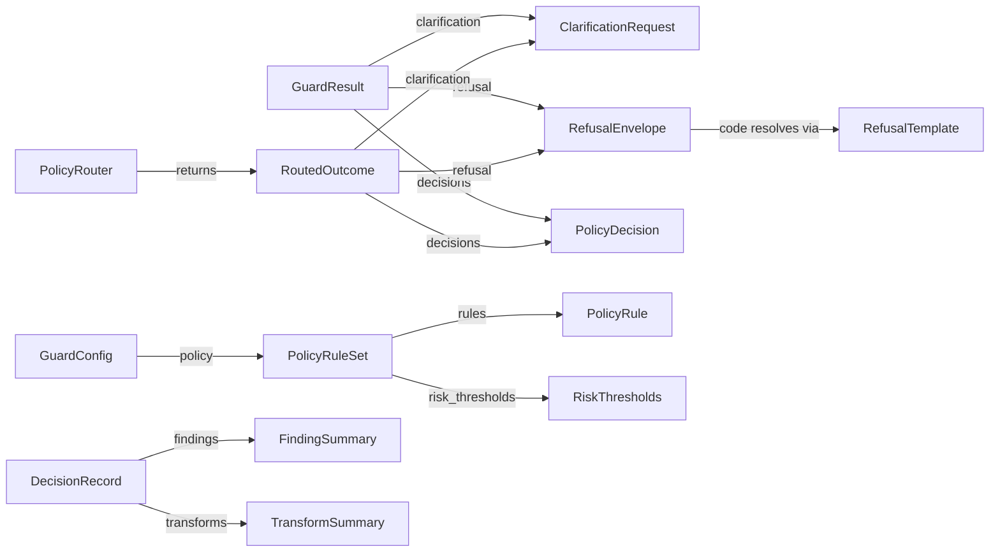

# Phase 1 — Data Model: Sanitization and Policy Core

**Feature**: 003-sanitization-policy-core
**Date**: 2026-05-01
**Scope**: Every new public typed model added by Spec 003 plus the two additive fields on existing Spec 002 models. Field-level descriptions, validation rules, stability markers, and JSON-serialization rules.

This file is the authoritative Phase 1 reference. The Spec 002 contract test suite at `packages/core/tests/contract/` extends to snapshot every entry below.

---

## Conventions

- Same as Spec 002: stability markers (`@stable` / `@experimental` / `@deprecated`), kind labels (`dataclass` / `pydantic` / `enum` / `protocol`), home package.
- Spec 003 ships everything as `@stable` *with one exception*: `RefusalCode.FIDELITY_DROP_PLACEHOLDER` remains reserved for Spec 005 — its template is a stub.
- Additive fields on existing models bump the package minor version. Stability of the existing surface is unchanged.

---

## 1. Existing Spec 002 models — additive changes

### 1.1 `GuardResult` (modified)

**Home**: `arc_guard_core.types`
**Stability**: `@stable` (unchanged; addition is additive)

| Field | Type | Default | Status | Description |
|---|---|---|---|---|
| `text` | `str` | required | unchanged | Possibly transformed text |
| `action` | `Literal["pass", "redact", "hash", "block", "tokenize"]` | `"pass"` | unchanged | Aggregate action |
| `findings` | `tuple[Finding, ...]` | `()` | unchanged | Detections |
| `decisions` | `tuple[PolicyDecision, ...]` | `()` | unchanged | Per-finding decisions |
| `refusal` | `RefusalEnvelope \| None` | `None` | unchanged | Set on HIGH (partial refusal) and CRITICAL (block) |
| `clarification` | `ClarificationRequest \| None` | `None` | **NEW (Spec 003 D1)** | Set when policy classifies the run as ambiguous and `clarification_enabled=True` |
| `bypass_reason` | `Literal["disabled", "error", None]` | `None` | unchanged | Pipeline short-circuit reason |
| `phase` | `Literal["pre_process", "post_process"]` | `"pre_process"` | unchanged | Side of the LLM call |

**Validation rules unchanged from Spec 002.** Additional rule: `clarification` may be populated only when `action != "block"` (clarification is a recovery path, not a block). The contract test enforces this.

### 1.2 `GuardConfig` (modified)

**Home**: `arc_guard_core.config`
**Stability**: `@stable`

Adds one field:

| Field | Type | Default | Status | Description |
|---|---|---|---|---|
| `policy` | `PolicyRuleSet \| None` | `None` | **NEW (Spec 003)** | Optional ruleset that drives the `PolicyRouter`. `None` preserves Spec 001 / 002 behavior. |

Cross-field validation: when `policy` is set, every `match` in the rule set must be a registered entity type (`TypedPlaceholder` or known `Finding.entity_type`); every `strategy` must be a registered name in the active `StrategyRegistry`.

---

## 2. `ClarificationRequest`

**Kind**: frozen dataclass
**Home**: `arc_guard_core.types`
**Stability**: `@stable`

Resolves D1 — the canonical placement for the clarification record.

| Field | Type | Default | Description |
|---|---|---|---|
| `suggested_rephrase` | `str` | required | Human-readable rephrase the caller should ask the user for. Non-empty. |
| `next_steps` | `tuple[str, ...]` | `()` | Optional supporting bullets the caller can render. |
| `triggering_rule_id` | `str \| None` | `None` | The `PolicyRule.id` that classified the run as ambiguous, if any. |
| `metadata` | `dict[str, Any]` | `{}` | Extension point. |

**Validation**: `suggested_rephrase` non-empty.

**JSON**: `dataclasses.asdict()` + `json.dumps()`.

---

## 3. `RiskBand`

**Kind**: `StrEnum`
**Home**: `arc_guard_core.policy`
**Stability**: `@stable`

```python
class RiskBand(StrEnum):
    LOW = "low"
    MEDIUM = "medium"
    HIGH = "high"
    CRITICAL = "critical"
```

Distinct from `RiskLevel` (per-finding severity). `RiskBand` is the **aggregate** band for one pipeline run.

---

## 4. `RiskThresholds`

**Kind**: pydantic v2 model (`frozen=True`, `extra='forbid'`)
**Home**: `arc_guard_core.policy`
**Stability**: `@stable`

| Field | Type | Default | Description |
|---|---|---|---|
| `low_max_count` | `int` | `2` | Up to this many LOW findings → LOW band |
| `medium_max_count` | `int` | `4` | Up to this many MEDIUM findings → MEDIUM band |
| `high_escalates_at` | `int` | `1` | Any HIGH finding count ≥ this → HIGH band |
| `critical_escalates_at` | `int` | `1` | Any CRITICAL finding count ≥ this → CRITICAL band |
| `soft_pii_aggregation` | `int` | `3` | If LOW count ≥ this, escalate to MEDIUM |

**Validation**: every threshold ≥ 0; `low_max_count` ≤ `medium_max_count`.

---

## 5. `PolicyRule`

**Kind**: pydantic v2 model (`frozen=True`, `extra='forbid'`)
**Home**: `arc_guard_core.policy`
**Stability**: `@stable`

| Field | Type | Default | Description |
|---|---|---|---|
| `id` | `str` | required | Stable identifier (e.g. `"redact_emails_v1"`). Used in `PolicyDecision.metadata` and `DecisionRecord.fired_rules`. |
| `match` | `str` | required | Entity type to match (e.g. `"EMAIL_ADDRESS"`, `"INJECTION"`, `"CUSTOMER_NAME"`). Must resolve to a known `Finding.entity_type` at validation time. |
| `strategy` | `str` | required | Registered strategy name (`"redact"`, `"hash"`, `"block"`, `"warn"`, `"tokenize"`, or a user-registered name). |
| `severity_floor` | `RiskLevel` | `RiskLevel.LOW` | Minimum per-finding severity for this rule to fire. |
| `rationale_template` | `str` | `""` | Human-readable string used in `PolicyDecision.rationale` and refusal envelopes. |
| `refusal_human_message` | `str \| None` | `None` | Optional override for the refusal envelope's `human_message`. Falls back to the registered `RefusalTemplate`. |
| `refusal_next_steps` | `tuple[str, ...] \| None` | `None` | Optional override. |
| `metadata` | `dict[str, Any]` | `{}` | Extension point. |

**Validation**:
- `id`, `match`, `strategy` non-empty.
- At policy load, the entire `PolicyRuleSet` validates that every `match` resolves and every `strategy` is registered (cross-field check; raises `ConfigCrossFieldError`).

---

## 6. `PolicyRuleSet`

**Kind**: pydantic v2 model (`frozen=True`, `extra='forbid'`)
**Home**: `arc_guard_core.policy`
**Stability**: `@stable`

| Field | Type | Default | Description |
|---|---|---|---|
| `rules` | `tuple[PolicyRule, ...]` | required | Ordered set of rules. Order is significant for tracing but conflict resolution uses a fixed precedence (research §11). |
| `risk_thresholds` | `RiskThresholds` | `RiskThresholds()` | Aggregation thresholds. |
| `clarification_enabled` | `bool` | `False` | Opt-in for the clarification flow (FR-019). |
| `ambiguous_threshold` | `RiskBand` | `RiskBand.MEDIUM` | The band at which an ambiguous classification kicks in (when enabled). |
| `default_action_when_no_rules_fire` | `Literal["pass", "block"]` | `"pass"` | What to do when findings are present but no rules matched. |
| `metadata` | `dict[str, Any]` | `{}` | Extension point. |

**Validation rules**:
- `rules` non-empty unless the caller intends a no-op policy (typed `ConfigCrossFieldError` if empty AND `default_action_when_no_rules_fire == "block"`).
- `clarification_enabled=True` requires `ambiguous_threshold ∈ {LOW, MEDIUM, HIGH}` (CRITICAL never asks for clarification).
- Every rule's `match` and `strategy` MUST resolve at load time.

---

## 7. `TypedPlaceholder` registry

**Home**: `arc_guard_core.placeholders`
**Stability**: `@stable`

Not a single class — a small helper module:

```python
DEFAULT_PLACEHOLDERS: dict[str, str] = {
    "EMPLOYEE_NAME":         "[EMPLOYEE_NAME]",
    "CUSTOMER_NAME":         "[CUSTOMER_NAME]",
    "INTERNAL_PROJECT":      "[INTERNAL_PROJECT]",
    "CONFIDENTIAL_LOCATION": "[CONFIDENTIAL_LOCATION]",
    "EMAIL_ADDRESS":         "[EMAIL_ADDRESS]",
    "PHONE_NUMBER":          "[PHONE_NUMBER]",
    "CREDIT_CARD":           "[CREDIT_CARD]",
    "US_SSN":                "[US_SSN]",
    "IP_ADDRESS":            "[IP_ADDRESS]",
    "UNKNOWN_PII":           "[UNKNOWN_PII]",
}

def register_placeholder(entity_type: str, label: str) -> None: ...
def get_placeholder(entity_type: str) -> str: ...
def format_placeholder(entity_type: str, occurrence: int, total: int) -> str: ...
```

`format_placeholder` implements D2: returns `"[<TYPE>]"` if `total == 1`; returns `"[<TYPE>_<occurrence>]"` if `total > 1` (1-indexed).

**Validation**: registered labels MUST start with `[` and end with `]`. The registration helper rejects malformed labels.

---

## 8. `PolicyRouter` Protocol

**Kind**: `typing.Protocol`
**Home**: `arc_guard_core.protocols.policy_router`
**Stability**: `@stable`

```python
@runtime_checkable
class PolicyRouter(Protocol):
    """Routes findings to strategies and aggregates the run-level outcome.

    Concurrency: sync. Implementations MUST be thread-safe — the pipeline
    may invoke from multiple coroutines / threads.

    Declared exceptions: ``PolicyRouterError`` (Spec 002 exception
    hierarchy).

    Failure mode: closed. A router error produces a ``RefusalEnvelope``
    with ``code = RefusalCode.STRATEGY_FAILED``.
    """

    def route(
        self,
        result: GuardResult,
        ruleset: PolicyRuleSet,
    ) -> RoutedOutcome: ...
```

`RoutedOutcome` (frozen dataclass, `arc_guard_core.policy`):

| Field | Type | Description |
|---|---|---|
| `transformed_text` | `str` | Text with all strategies applied in span order |
| `decisions` | `tuple[PolicyDecision, ...]` | One per fired rule (or per finding-group when aggregating) |
| `aggregate_action` | `Literal["pass", "redact", "hash", "block", "tokenize"]` | Final aggregate action |
| `aggregate_band` | `RiskBand` | Risk band used to drive `action` |
| `refusal` | `RefusalEnvelope \| None` | Built when band is HIGH or CRITICAL |
| `clarification` | `ClarificationRequest \| None` | Built when band is at `ambiguous_threshold` and `clarification_enabled=True` |
| `fired_rule_ids` | `tuple[str, ...]` | Rule ids that contributed to the outcome |
| `transforms` | `tuple[TransformSummary, ...]` | Per-strategy transform metadata for the decision record |

---

## 9. `DecisionRecord`

**Kind**: frozen dataclass
**Home**: `arc_guard_core.decision`
**Stability**: `@stable`

The audit-grade summary of one pipeline run. Emitted via `Logger.event` and `MetricSink`.

| Field | Type | Description |
|---|---|---|
| `correlation_id` | `str \| None` | Drawn from `GuardContext.correlation_id` when present |
| `phase` | `Literal["pre_process", "post_process"]` | Which side of the LLM call |
| `aggregate_action` | `str` | The action driven by the aggregate band |
| `aggregate_band` | `RiskBand` | The aggregate band |
| `findings` | `tuple[FindingSummary, ...]` | One per detected finding (no raw text — span only) |
| `transforms` | `tuple[TransformSummary, ...]` | One per applied strategy |
| `fired_rules` | `tuple[str, ...]` | Rule ids that fired |
| `refusal_code` | `str \| None` | Set when refusal was built |
| `clarification_present` | `bool` | True iff `ClarificationRequest` was built |
| `latency_ms` | `float` | Total `_run` duration (router + strategies + emission) |
| `metadata` | `dict[str, Any]` | Extension point. **MUST NOT** contain raw payloads (contract test scans for forbidden substrings) |

**FR-023 invariant**: no field of `DecisionRecord` exposes raw masked or original text. Spans are reported as offsets only.

---

## 10. `FindingSummary`

**Kind**: frozen dataclass
**Home**: `arc_guard_core.decision`
**Stability**: `@stable`

| Field | Type | Description |
|---|---|---|
| `entity_type` | `str` | e.g. `"EMAIL_ADDRESS"` |
| `start` | `int` | Span start offset |
| `end` | `int` | Span end offset |
| `length` | `int` | `end - start` (denormalized for log readers) |
| `risk_level` | `RiskLevel` | Per-finding severity |
| `inspector` | `str` | Which inspector produced this finding |
| `score` | `float \| None` | Optional confidence |

---

## 11. `TransformSummary`

**Kind**: frozen dataclass
**Home**: `arc_guard_core.decision`
**Stability**: `@stable`

| Field | Type | Description |
|---|---|---|
| `strategy` | `str` | Registered strategy name (e.g. `"redact"`) |
| `target_finding_index` | `int` | Index into `DecisionRecord.findings` |
| `before_length` | `int` | Length of the original span |
| `after_length` | `int` | Length of the replacement (or 0 for `block` / `warn`) |
| `replacement_kind` | `Literal["placeholder", "hash", "token", "removed", "warn", "passed"]` | Categorical replacement type |
| `metadata` | `dict[str, Any]` | Strategy-specific extras (e.g. tokenizer suffix index). MUST NOT contain raw payload. |

---

## 12. `RefusalTemplate`

**Kind**: frozen dataclass
**Home**: `arc_guard_core.refusal.templates`
**Stability**: `@stable`

| Field | Type | Description |
|---|---|---|
| `human_message` | `str` | Default message for the associated `RefusalCode` |
| `next_steps` | `tuple[str, ...]` | Default next-step bullets |

A registry `DEFAULT_REFUSAL_TEMPLATES: dict[RefusalCode, RefusalTemplate]` is exported from the same module. `register_refusal_template(code, template)` is the public mutation API.

---

## 13. Strategy registry contract

**Home**: `arc_guard.strategies.registry` (in `pip`, NOT `core`)
**Stability**: `@stable` (the registry's public API is stable; the implementations behind it are pip-internal)

The registry is mentioned here because the contract `PolicyRuleSet` validation depends on it. Public API:

```python
def register_strategy(name: str, strategy: ActionStrategy) -> None: ...
def get_strategy(name: str) -> ActionStrategy: ...
def is_registered(name: str) -> bool: ...
def list_registered() -> frozenset[str]: ...

# Decorator form
def strategy(name: str) -> Callable[..., ActionStrategy]: ...
```

Built-in registered names (registered on import of `arc_guard.strategies`):

| Name | Behavior | Module |
|---|---|---|
| `redact` | Typed-placeholder replacement (D2) | `arc_guard.strategies.redact` |
| `hash` | HMAC-SHA256 with deterministic salt | `arc_guard.strategies.hash` |
| `block` | Empty text + populated `RefusalEnvelope` | `arc_guard.strategies.block` |
| `warn` | Pass-through; `rationale` flags the warning | `arc_guard.strategies.warn` |
| `tokenize` | `[<TYPE>_TOK_<N>]` per-input deterministic | `arc_guard.strategies.tokenize` |

---

## 14. Stability matrix

| Type | Spec 003 status | Modified by future spec? |
|---|---|---|
| `GuardResult` (with `clarification` field) | `@stable` | Spec 005 may add fidelity-related fields (additive) |
| `GuardConfig` (with `policy` field) | `@stable` | Specs 004 / 005 may add fields (additive) |
| `ClarificationRequest` | `@stable` | Spec 005 may add fidelity hints (additive) |
| `RiskBand` | `@stable` | No |
| `RiskThresholds` | `@stable` | Specs 005 / 006 may add weighting fields (additive) |
| `PolicyRule` | `@stable` | Specs 005 / 006 may add condition fields (additive) |
| `PolicyRuleSet` | `@stable` | Specs 005 / 006 may add fields (additive) |
| `PolicyRouter` Protocol | `@stable` | Spec 005 may add an intent-aware variant (additive) |
| `RoutedOutcome` | `@stable` | Spec 005 / 006 may add fields (additive) |
| `DecisionRecord` | `@stable` | Spec 005 will populate `metadata` with fidelity scores |
| `FindingSummary` | `@stable` | Spec 006 may add deception-detection fields |
| `TransformSummary` | `@stable` | No |
| `RefusalTemplate` | `@stable` | No |
| `TypedPlaceholder` registry | `@stable` | Specs 005 / 007 may add new default labels |

Every Spec 003 stable type is a structural contract that downstream specs extend additively. Renames or removals require a major-version bump and the deprecation flow already established by Spec 002.

---

## 15. Field-level relationships



All public types are immutable (frozen dataclasses or `frozen=True` pydantic models). Mutation of any returned value is undefined behavior — same rule as Spec 002.
